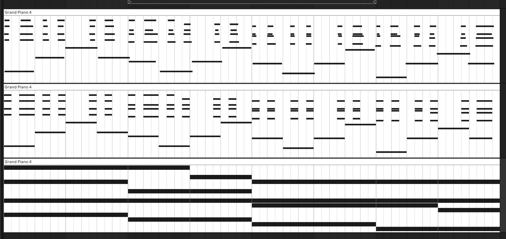

# Final Project

David and Henry's MIDI Transformer for Streamlining Composition & Mockup Process

### What you made or built
Henry and I built a transformer model in PyTorch which intakes MIDI data and fulfills one of two functions with it: either to generate more MIDI that expands upon the given material or to adjust the MIDI to sound more "human." From that, we were able to make a few small demos which showcase the current capabilities of the model, with MIDI clips that we were able to upload into Ableton Live for a better representation of the MIDI data.

### How machine learning is involved
The model begins with a tokenizer, which was very relevant in regards to my research for the midterm project. We specifically pulled from the MIDITok library and it's different tokenization schemes as the basis for creating a model that utilizes machine learning. We additionally had to make use of different datasets in order to train the model on. For the MIDI generation process we made use of the [POP909](https://github.com/music-x-lab/POP909-Dataset) library, which contains MIDI data for a wide variety of different western, Japanese, and Korean pop songs. For the humanization process we used the [Maestro v2](https://www.kaggle.com/datasets/jackvial/themaestrodatasetv2) library, which contains thousands of MIDI recordings from real professional pianists that convey the nuances of piano playing in varying note durations, velocities, and pedalings.

### How you implemented the project
We initially knew that what we wanted to produce was some kind of tool to enhance MIDI for use in a digital audio workstation. So the first step was figuring out how we wanted to implement such a tool, and what we decided on putting together in this time frame was functionality for expanding upon a given MIDI clip and for enhancing the expressiveness of a MIDI clip. 

After this we had to get our data ready to be used by the model for training. We knew that we'd be tokenizing our MIDI information with MIDITok, but we had to decide on a tokenization scheme to use. We eventually decided on REMI (Revamped MIDI) due to its straightforward approach and its identification of note duration (as opposed to just note on and note off properties) for the tokenization. 

We also had to pick out the datasets that would be best for training the model. POP909 was best for the MIDI generation because its metadata outlined clear relationships in the MIDI between melody, countermelody, and accompaniment. Maestro v2 was the best for the humanization function because its MIDI data came from professional pianists playing and therefore had the expressive qualities in note duration, velocity, and pedaling necessary to alter basic clicked in MIDI notes. In addition to pulling this dataset, we also had to go through and esssentially quantize each MIDI file so that the model could be trained on what it will be given and what we want it to produce. And after spending some time training it we were given a model that could produce the MIDI we were looking for, and so we put together some brief demo generations to judge the effectiveness of the model. 

### What you learned

In some ways I was surprised by the results of this project and in other ways it somewhat met my expectations. I was rather pleased with the results of the humanization function, as I think it turned out very well and will actually be a useful tool in the future. The built in "humanization" that Ableton has works well, but the tool that we developed seems to have a bit more nuance in the sound because it does more than just lightly randomize the beginning of each note. With this tool, we'll be able to create instrumental mockups that sound a bit more professional, so this product has a clear practical application for me. See the below photo to compare the humanized MIDI (top line) with the blocky, clicked in MIDI (middle line).

I was expecting the actual MIDI generation to be a bit more difficult to do well, and while I was surprised by what we produced I still believe it needs a lot of work. The generations have moments of clarity that don't sound too terrible, but its connection to the source material and random odd-sound moments definitely hold it back. But considering the small amount of time that we had for this project, I think it is already in a pretty good spot to be iterated upon more in the future to receive more polish. See the below photo to compare the given MIDI (in blue) to the MIDI generated based off of that input (in red).

### Reflection: challenges, unfinished work, and what you would change

While a less pressing challenge was figuring out exactly what direction we wanted to take the project in, the bigger challenge lied in finding the right data to use depending on the direction we chose. Finding datasets that pertained to these specific musical functions we wanted to execute proved rather difficult, especially when the functions we wanted to create required more musicality that a machine learning model would struggle to emulate.

One thing the results of this project did confirm for me though was that such tools are much more applicable to support the process of composing and making mockups instead of fully replacing it. Committing to such a project taught me that the direction I would love to take machine learning for music in lies much more in these kinds of projects instead of generative audio. I absolutely forsee Henry and I continuing this project on the future. Thankfully I can say we did not really have any unfinished work as we left the true nature of our final project with some variability and were not sure how far we would get with it. I can't say there is anything that I would particularly change about this project currently as it is still in its infancy, but I am sure that will change as we continue working on it.
