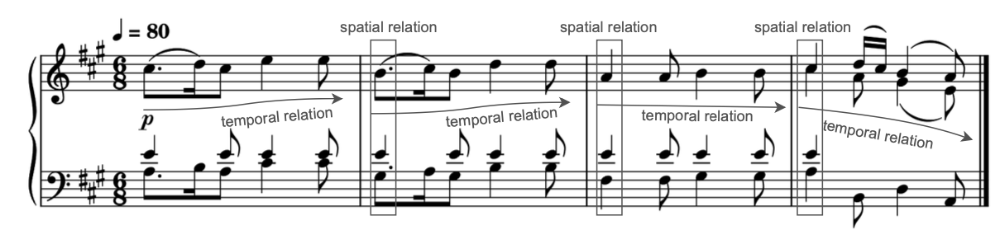
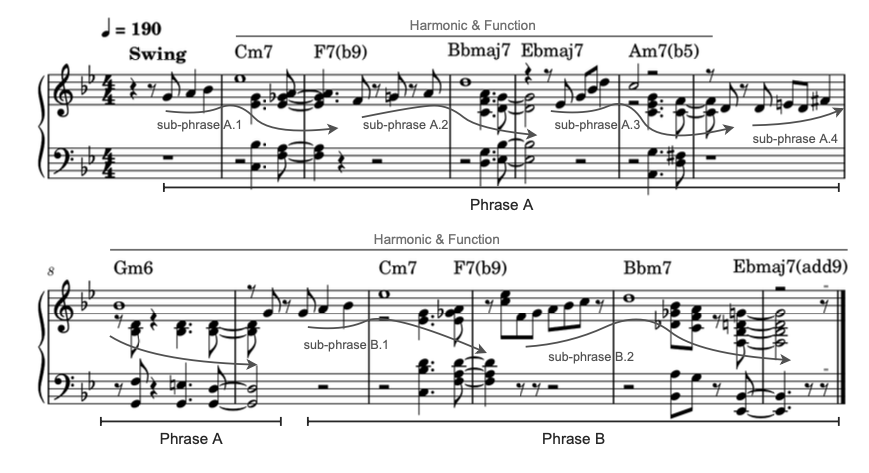
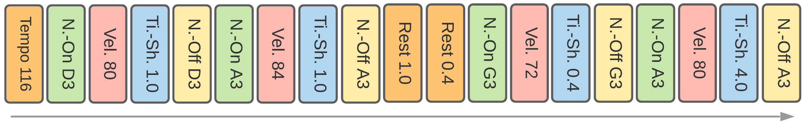
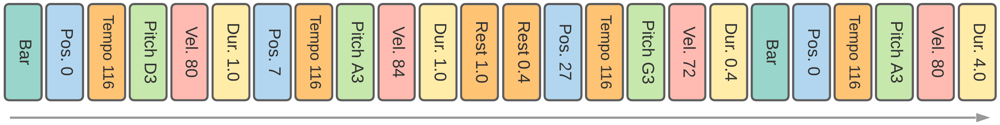
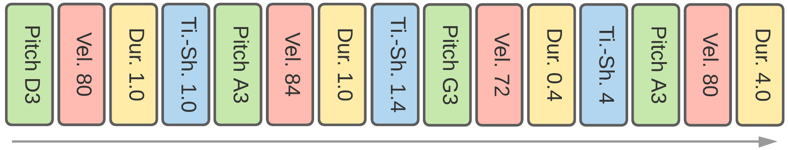
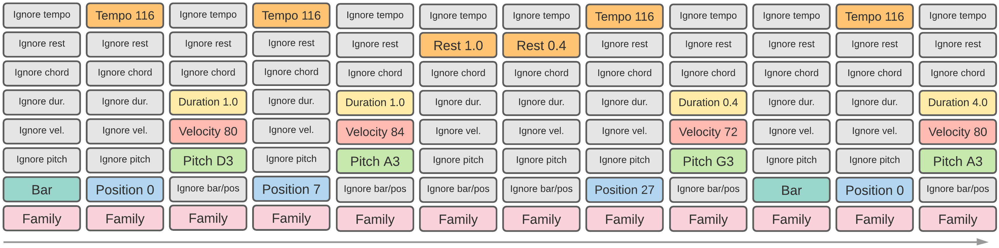

# Presentation - Tokenization and Musical Application

## What is Tokenization?
- The process of converting musical information into smaller units (tokens)
  - letter tokenization: “charles holbrow is cool, is he not?” = {c,h,a,r,l,e,s,o,b,w,i,n,t}
  - word tokenization: “charles holbrow is cool, is he not?” = {charles, holbrow, is, cool, he, not?}
- [Where have we seen tokenization in LLMs?](https://platform.openai.com/tokenizer)

## Challenges When Dealing With Music Over Text
### Information beyond temporal dimension: verticality
  - Multiple notes
  - Multiple tracks
  - Multiple parameters

    

### The complex structure of music
  - Melodies, textures, phrases, sub-phrases, harmonic function, etc.
  - Long-term structure when generating samples

    

## Parameters to Tokenize:
### 1. Pitch range
- MIDI integers, 0 to 127 (ex. C4 = 60)
### 2. Number of velocities
- Volume of note, 0 to 127 (with 0 being silence)
### 3. Beat resolution
- Sample rate per beat
### 4. Additional tokens
- Chords
- Rests
- Tempo

## [MidiTok](https://miditok.readthedocs.io/en/latest/index.html)
- Python package, different tokenization schemes
### 1. MIDI-Like
- 413 tokens total
  - 128 note-on and note-off events
  - 125 time-shift events (8ms-1sec)
  - 32 velocity events

### 2. Revamped MIDI-Derived Events (REMI)
- note-on, NO note-off
- note velocities
- note **duration**

### 3. Structured
- Tokens provided in order: pitch, velocity, duration, time shift

### 4. Compound Word
- Begin with embedding independent tokens
- Merge into "super token" for each note

