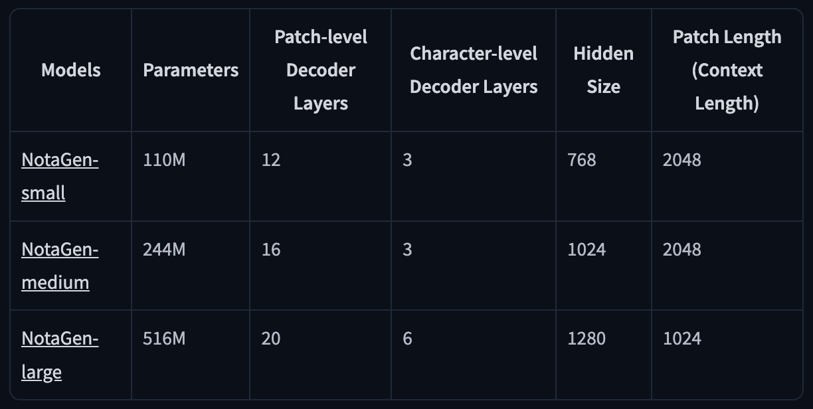
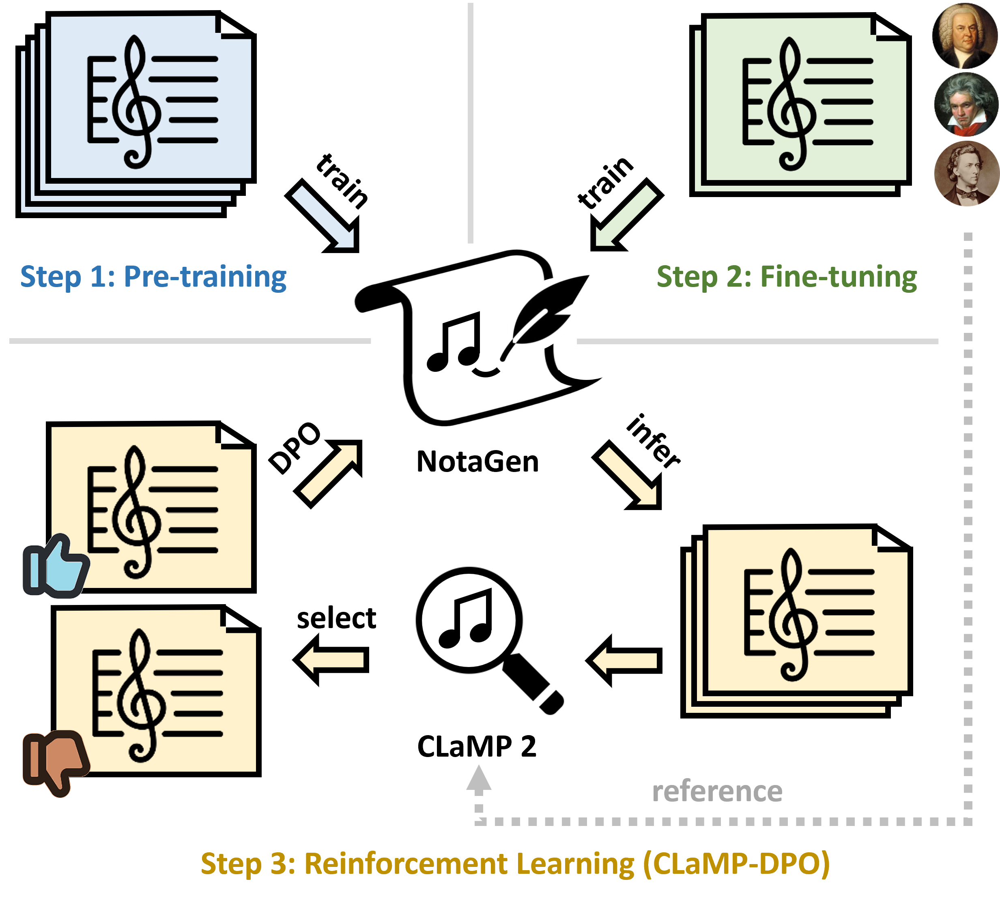

# Using NotaGen to Compose Classical Piano Pieces

## [NotaGen](https://huggingface.co/spaces/ElectricAlexis/NotaGen)
- Model for generating **classical sheet music**
- Approach similar to LLMs
- Inputs:
  - Period
  - Composer
  - Instrumentation
- Outputs:
  - PDF of sheet music
  - MIDI file
  - mp3 of MIDI
  - abc file
  - xml file

Pre-training Weights:

## Training

- 1. Pre-training - 1.6M pieces
- 2. Fine-tuning - ~9,000 *classical* compositions
- 3. Reinforcement learning - CLaMP-DPO

## References and Composition Generations
- [Compositional References](https://www.youtube.com/playlist?list=PLwBfSVOZgr-hsfNzypGkp6q2WZmkIKFN4)
### Piece 1: Debussy
Inputs:
- Period - Romantic
- Composer - Debussy, Claude
- Instrumentation - Keyboard

### Piece 2: Chopin
Inputs:
- Period - Romantic
- Composer - Chopin, Frederic
- Instrumentation - Keyboard

## Strengths and Weaknesses
- Strengths:
    - Quick turnaround
    - Straightforward & simple to use
    - Multiple files ready to download on the page
    - Harmonically characteristic & serviceable pieces
- Weaknesses:
    - Lumps multiple periods all into the "romantic" category
    - Not many options for generation
        - Can’t specify key, time signature, tempo, length, etc.
    - Hugging Face paywall
    - Compositions are "in the box"
    - Compositions can't view the bigger picture, lacking "storytelling"