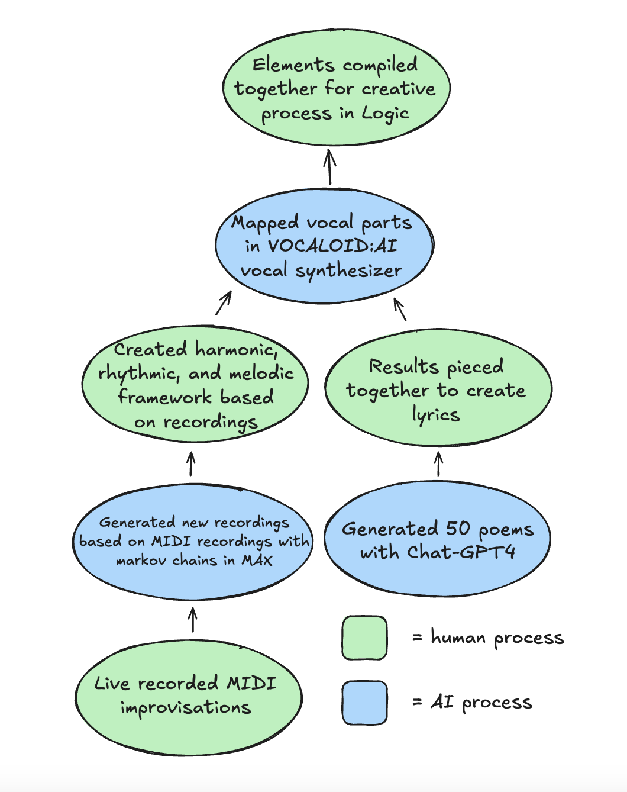

# Research Work Phase 1: AI Song Contest Analysis

## Part 1: Song Selection
- Song title: [Reboot](https://www.aisongcontest.com/participants-2023/carmel-freeman)
- Artist: Carmel Freeman
- Year: 2023
- Summary: This song is meant to reflect feelings of disconnection and alienation that the artist felt after a bipolar disorder diagnosis, told through the lens of a non-human intelligence experiencing a similar struggle.
- Reference: [HAISP Dataset](https://docs.google.com/spreadsheets/d/1ZzV0MdhRn0Apb0k03j52OlbP8nxwo2t4IRmOd8nSa-o/edit?gid=227254321#gid=227254321)

## Part 2: Technical Analysis

### ML Architecture

The primary models used were markov chains in Max, ChatGPT-4, and [VOCALOID:AI](https://www.vocaloid.com/en/?srsltid=AfmBOoplbiswIe7HECrsBfRBOZ8F-yF7kZNxzfToaZ2MEmi2bTtN5V49). The markov chains were trained on snippets of MIDI data and performed inferences into Logic based on that data, used to create fully generated music that is based on the artist's own style. ChatGPT was used to generate lyrics that conveyed the intended emotions of the piece, with no training from the artist specifically. Information on how the vocals were synthesized with VOCALOID:AI were left vague, but it can be assumed that they used their own vocal samples to synthesize their own voice patch.

### Tool Ecosystem

The tools used for this project are primarily off-the-shelf, with ChatGPT-4 and VOCALOID:AI being widely accessible models. The creator doesn't detail their use of markov chains in Max, but it can be assumed they used the [ml.*](https://cycling74.com/packages/mlstar) library. Because these tools were all used for primarily creative endeavors, they were not really integrated until the final stage when everything was put together in Logic.

### Data Pipeline

To ensure the desired output, the artist made a large volume of their own real-time performed improvised MIDI samples to train the markov chains in Max. This program would then process offline to produce samples. In the case of the markov chains and Chat-GPT4 usage, the quality assurance was determined by creating a large amount of samples, such as 50 different poems for lyrics, and manually sifting through them to determine the most suitable ones. 

### Workflow and Process

Human intervention was a key part of the project, as the artist not only contributed greatly to the production of the music itself but also moderated the outputs from each model. The project began with the generation of the music in Max using the markov chains, followed by the generation and compilation of lyrics, the synthesis of vocals in VOCALOIDLAI, and then the cumulation of these elements in Logic. It is evident that the artist intended to work alongside their tools in the creative process, both in moderating them and in using them as inspiration to try new compositional techniques. 

## Part 3: Musical Analysis

### Structure

The entire piece is evidently through composed, as little if any material repeats itself. It is clearly divided into distinct and unique sections which contrast each other interestingly yet still feel cohesive due to human curation. While the model in Max was meant to predict what should come next in the structure and piece as a whole, it was ultimately moderated and curated by the artist.
  
### Musical Elements

All musical elements of harmony, rhythm, and melody were ultimately determined by the artist but were inspired and influenced by the generations of the markov chains in Max, which where in turn generated from their own uploaded MIDI samples. With the piece being through composed, the harmonic and melodic elements have very little structure other than that it seems they attempt to not repeat. In terms of timbre, there is little to no live instrumentation, with most elements being derived from synthesis and/or DSP. 
  
### AI Signatures

The element where AI is most obviously involved is the vocals, but because it is vocaloid synthesis it is not attempting to hide the involvement of AI. This style of vocals could certainly exist in the uncanny valley to some listeners, but vocaloid technology is prevalent enough these days to where most are aware of it and would not perceive it as existing in the uncanny valley. The AI approach seems to work very well in this through composed style, as this piece sounds like it could fit in well compositionally with other contemporary classical style compositions. From what I can tell, it does not seem like the artist was limited in any way as they still had creative control over the project instead of letting their AI tools take the reins.

## Part 4: Music Critic

### Comparative Analysis

It seems that many of the other contest entries are focused on seeing what AI is capable of producing, but in Carmel Freeman's case it seems that his approach was to see how AI could inspire and push him creatively. He additionally wanted to use AI as an avenue for emotional expression within his song. Not much trade-off occurred due to how much human intervention existed in the songwriting process, and with the fact that the AI is used for inspiration instead of automation there is not much application in terms of scale and reproducibility.

### Ethics and Aesthetics

Because the markov chains were trained on his own MIDI samples, the artist establishes their own creative ownership over that aspect of the music. The topic gets more contentious with the lyrics, as the artist pondered their use of generation with Chat-GPT without giving a clear conclusion: "... how could something I didn't directly come up with still be mine? It wouldn't exist without me, and yet it wouldn't exist with me alone." And at the time of this song contest, environmental impacts were not considered as much so information regarding that is limited.

### Innovation Assessment

This project was made more to observe how a musician could effectively use AI for the creative process and storytelling. So the contributions of this piece are more in the field of music than the field of AI research. It's useful to see how a musician could use AI and what we could change in our current AI tools to support the creative workflow. 