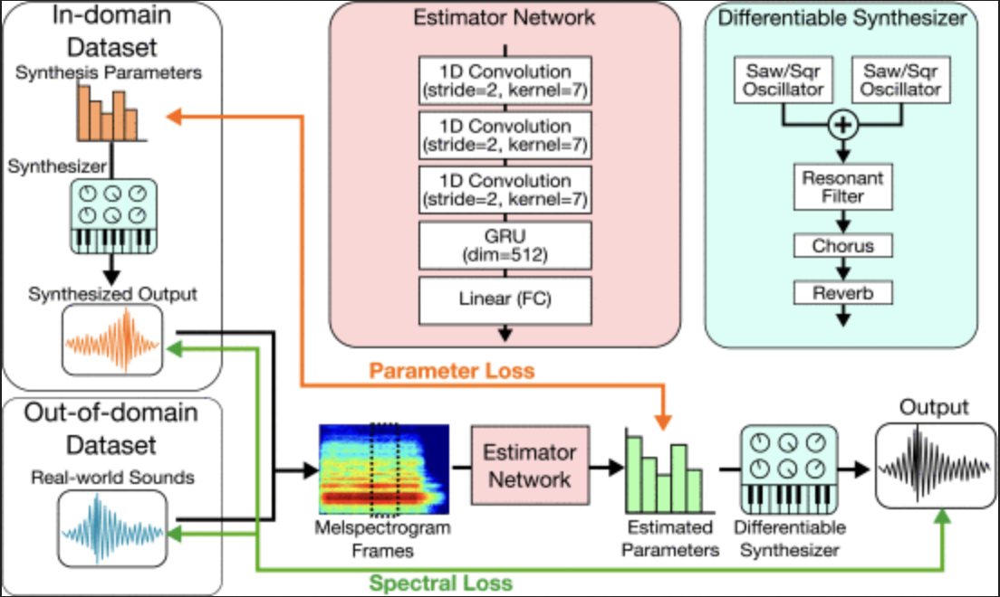
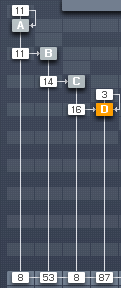
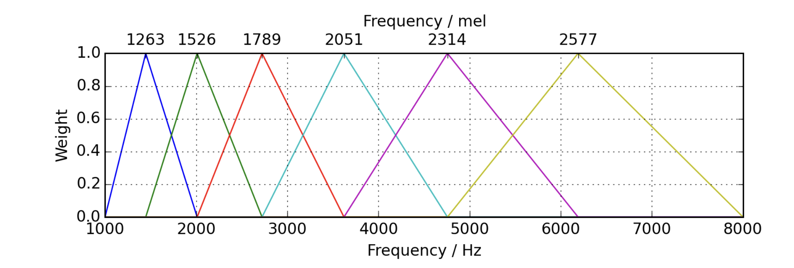

# ML Midterm Project Documentation
Ethan Bessette

## Proposal

### Vision
Create a model that estimates synthesizer parameters to create patches that match target sounds.

### PseudoCode

From https://ieeexplore.ieee.org/document/10017350

#### Differentiable synthesizer
In Csound, I will design an FM synthesizer with 2 audio oscillators, 1 control oscillator, and one noise generator. They will all be able to modulate each other and themselves, like in FM8. Each will have an amplitude envelope.

Even with few numbers of oscillators, a large number of sounds can be created. 

https://drive.google.com/file/d/1FBpwcrP1YOWGa7a5kgqJJ4nyOe9Wz6hr/view?usp=sharing

#### In-domain dataset
All the differentiable parameters will be randomized and coupled with the synth's resulting audio output.
This process will be automated in the terminal by generating random values to fill a csv for each differentiable synth parameter, reading the values into csound and saving the resulting audio along with the csv of parameters.

#### Out of Domain dataset
Additionally, audio that doesn't have coupled synth parameters will be used.

#### Structure / Architecture
This is an area that I have some questions and concerns about. One option is to follow the structure from the paper diagram I included above. On the other hand, I don't know enough about the various structures and optimization / training types.
Because of this, I might use similar structure to what we've seen in class.

I think if I decide on what structure to use conceptually, I would just need a generic example so I can change it to fit my needs.

Ideas could include:
Convolutional
Multi head attention layers within transformer to find changes across time.

##### Data comparisons
I still have to learn how to use the calculated loss to optimize. I will review the nn_2 and 3 to see what optimization functions are used. For example, the loss of each individual synth parameter might be summed or averaged somehow into overall loss.

For **audio spectral loss**, use MelSpectrogram. The number of bands can be adjusted, the window size, and hop length.

For **synth parameter loss**, each synth parameter will be normalized from 0 to 1 and the difference taken for each.

#### Training
The datasets will be divided 80-10-10 training validation testing.
For in domain data, the loss between estimated synth parameters and real will be calculated and used to optimize.
For all data, the audio spectral loss will be calculated by taking the difference of the MelSpectrogram of original and predicted audio and used to optimize.

## Notepad
Window of 4 chords, what is most likely next chord?
Training:
- 4 chords of song, give next chord

So for audio, give a window of seconds and therefor x samples. Predict next y samples, add to output, move window

Diffusion model
Encoding: add noise to data over course of time steps until full noise.
Train it to recognize where it is in timestep, therefore how much noise to remove to get back one tilmestep, repeat until back to original image
It trains it to predict noise to remove per timestep until it gets an image that resembles the training images

DDSP
Train a model to control digital signal processing parameters to create a complex synthesizers given note pitch, velocity, and length
- label training data with note pitch, velocity, and length
- window of x notes of input (range of input length from 1 to maybe 4)

Get output sound, match to original synthesizer, adjust sytnhezsizer parameters to reduce difference
- gradient descent

Calculating the loss change in output and input to gradient descent 
- could be used for deep ANC

https://realpython.com/gradient-descent-algorithm-python/
This explains gradient descent. For a 2d vector (x,y) it finds a 1d vector, the minimum, by getting the gradient (the derivative of the 2d vector) and 

The next chord predictor is probabilistic. It gets optimized 

I could get samples of an instrument or my voice. Then
DDSP
Create structure of synthesizers and parameters. Randomize parameters, calculate loss, move parameters to minimize loss.
I could calculate gradient descent of move input towards trained function
For each audio sample, calculate difference of output to original

One hot encoding aligns output with true correct answer in one hot encoding to determine loss.
So for my model, it should have one output for each changeable synth parameter.

## The Process

### Dataset creation
I created a csound file that outputs 32 floating point wave files at each of 12 notes through the same synthesizer, naming them the index of the synth along with the note number. Outputting results in a dataset being generated that contains sets of 12 notes for each set of random synth parameters along with text files holding the synth parameters. As of now, I haven't found a way to output only the synth parameters, so the text file contains a header that will need to be discarded when cleaning data for machine learning training.

There is an encode.csd file that generates parameters and creates audio for them, as well as a decode.csd that reads parameters and generates data. I tested them and it works. I also tested them on my own new parameters that I changed by hand.

The next step will be figuring out how to get the .csd to run in the correct order in training. Also, training will take a long time unless I figure out how to make generating audio much faster for the amount of data I have.

While the data is generating, I'm checking my activity monitor and it looks like processing is kept to 1 processor. I wonder if I could figure out multi threading to make it faster as well as forcing csound to make new instances instead of reusing them.

#### Problems
1. One problem was figuring out how to keep the pitch relatively constant during self modulation. When an oscillator self modulates its frequency, the pitch is perceived as lowering as the sidebands to the positive and negative are created. I researched ways to keep this constant and first kind Bessel functions were what came up. I tried to ask ChatGPT to help write functions to keep the pitch normal by calculating the spectral center as a function of f0 and self modulation index, but when I tried to implement it in Csound, it was too computationally expensive and sound froze every time. I spent a while finding a workaround and I ended up using a realtime polynomial function to approximate the amount of frequency offset within the range of parameters that I was using. It stops working at a certain point, but that doesn't matter since the way I programmed the synth it will never generate parameters outside that range. I also realized that a small amount of modulation by the original frequency helped to stabilize the pitch. I slightly modulate the frequency of the oscillator with a separate oscillator at its original frequency as a function of self-modulation index. While it adds some harmonics not present in true self-modulation, it doesn't matter.

2. Another problem was figuring out how to keep the parameters constant while generating 12 different pitches of the same parameters. I ended up using two different scheduler instruments to do this. One scheduler spawns instances of the other scheduler so that synth sets can be generated in parallel. The other scheduler spawns 12 parallel instances of one set of parameters at different pitches. The instances themselves output the audio data, while the second scheduler holds the generated parameters and outputs them when done.

3. Originally, the synth parameters were generated in each instance of a note. This obviously didn't work because what was supposed to be different pitches with the same parameters actually all had different parameters. To fix this, I generated each parameter from 0 to 1 in the 2nd scheduler instrument and set up the note instrument so that the scheduler could pass in the parameters when called. The note instrument can further process these normalized values. This allows the eventual machine learning algorithm to be able to output normalized values for the parameters which can be used to generate audio.

4. It turns out Csound re-uses instances of instruments to save storage in memory. This was causing a problem where two clips were combined in one in the output audio. To solve this, I made sure to offset the parent scheduler so that it never created secondary schedulers at the same time. Note to self, I bet if I use more primary schedulers than the note length, I might have to change this so that it instantiates notes with a new identity instead of simply offsetting.
    - Update, yes, this is the case. If I were to keep the note 5 seconds, that means I can only uses 5 instruments at a time. To generate 1000 sets of synth parameters, it would take 200 seconds to generate the dataset. Honestly that's reasonable, I'll keep it how it is for now. Nevermind 200 seconds only generates 200 examples. Def something I need to fix.

#### DDSP
Includes tensor operations that create audio synthesis as part of the machine learning function. This makes the parameters e2e differentiable.

##### Original DDSP Library
1. Preprocess raw audio
    - detect fundamental frequency and loudness over time for 5 second clips of audio, store in a TFRecord file
2. Save dataset stats so that future inputs can be processed to match training data
    - pitch (f0), power, loudness, quantile transform.
3. 

##### My Implementation

1. Break training audio into Mel spectrogram at time points

2. Given spectrogram,
3. estimate synth parameters
4. process audio tensor from those parameters, convert to Mel spectrogram
5. Find loss between output and training Mel spectrogram
6. Find loss between estimated and real synth parameters

Flow of DDSP library:
- preprocess raw audio into dataset
    - detects 

1. expects Nn to output amplitude over time, harmonics over time, and fundamental f over times
2. Uses those in additive to create pitched part of input
3. Uses noise and filter to create unpatched
4. The output of the model = input of synth closely reflects the spectral and envelope data of the original audio, 

