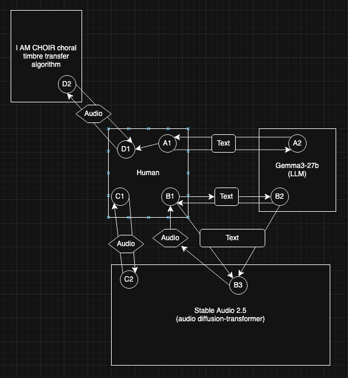

# Research Work Phase 1: AI Song Contest Analysis

Submitted in correct directory with correct filename	5
Song title, artist, year, and summary	10
Technical Analysis section (complete, sufficient depth)	25
Musical Analysis section (complete, sufficient depth)	25
Music Critic section (complete, sufficient depth)	15
At least one workflow diagram	10
References section with cited sources	10
Total	100

## Song Selection
| Title | Artist | Year |
| --- | --- | --- |
| MF U UP | DADABOTS | 2025 |

DADABOTS are a duo of musicians and AI researchers who met at Berklee College of Music in 2012. They co-founded Harmonai, the music research team at StabilityAI, and there created Stable Audio [1].

This submission is a genre bending piece with lots of energy that repeats the phrase MF U UP. DADABOTS primarily used their own Stable Audio that they continually re-trained to achieve the sound they were aiming for [2].

## Technical Analysis

### ML Architecture

    Models used (architecture, parameters, training data)
    Why these models were chosen
    Input/output formats and data representations
    Training vs. inference pipeline
    
The team primarily used Stable Audio, the model they continue to improve through their research at Stability AI [1,2], which was likely their reason for choosing the model. It is capable of audio-to-audio; in their recent paper, they informally experimented with its style and timbre transfer abilities [5]. It is also capable of text-to-audio [3].

The model can input text to output audio. It can be retrained on new audio by substituting new audio for x0 during the ping-pong ARC post-training [5]. This is what enabled the team to use timbre transfer and inpainting. They were able to make adjustments to the overall song in sections [2].

    

### Tool Ecosystem

    Software and hardware used
    Version numbers and configurations (if available)
    Integration between tools
    Custom code vs. off-the-shelf solutions

There is no information on which machines and operating systems the team used. However, they used the off-the-shelf solution I AM CHOIR [2], which only runs on macOS with Apple Silicon (M1 and later) [4], making it likely they used macOS.

All the models they used ran on their local machines [2].

As noted, they used their own diffusion-transformer model Stable Audio. They likely started with the latest version, 2.5, released in May of 2025. This is likely because this version was release prior to the AI Song Contest deadline of August 2025.

They also used a customized off-the-shelf solution, I AM CHOIR to shape the vocals [2]. The model was trained on a gospel choir, children's choir, and gang vocals [4].

They used an LLM (Gemma3-27b).

They did use I AM CHOIR models to shape the voices. The various tools were kept separate. The Stable Audio generated the main sections of the background. I AM CHOIR processed the vocals.

### Data Pipeline

    Source data types and formats
    Preprocessing and transformations
    Feature engineering decisions
    Real-time vs. offline processing
    
There is a lot of information available about how stable audio works in specific instances, but not on how it's working for the AI song contest. That being said, this is the internal process described for the most recent paper they released, looking at improving the inference speed for the stable audio open text-to-audio model (note that SAO means Stable Audio Open): "Our latent generative models synthesize variable-length (up to 11.89s, with a timing control [4]) stereo audio at 44.1kHz from text. It consists of the pre-trained 156M parameter autoencoder from SAO that compresses waveforms into
a 64-channel 21.5Hz latent space, a 109M parameter T5 text embedder, and a Diffusion Transformer (DiT) that operates in the latent space."

I don't understand it enough to explain what's happening for this technical analysis. It seems the aim is to make realtime processing more feasible.
    
    
### Workflow & Process

    Project phases (conceptualization, experimentation, refinement, production)
    Key decision points and alternatives considered
    Where and why humans intervened
    Include a workflow diagram showing data flow, transformations, and human decision points (use draw.io, Lucidchart, or similar)
    
They recorded vocals, then used stable audio to generate short samples of the backing track around them. They handpicked ones they liked and used stable audio to refine the assembled piece. They used I AM CHOIR to process the vocals. They used a locally run LLM (Gemma3-27b) to extend the lyrics and for help with prompting Stable Audio. They used inpainting with Stable Audio to change certain sections of the song without changing the whole song [2]. Finally, they used a human producer, Encanti, to master the track [2]. This project was a combination of coding, training, prompting, adjusting, and finally human taste through using a producer to shape the final sound.

The workflow was a creative process shared between human and AI. There are a number of processes that were ongoing over the course of the project, as shown in the Figure.
- A1 <=> A2: DADABOTS picked the main lyrical theme and motif, then used Gemma to extend lyrics [2].
- A1 -> D1: DADABOTS recorded the lyrics into the DAW.
- B1 <=> B2: DADABOTS also used Gemma to improve the prompts they used for generating audio with Stable Audio across iterations [2].
- B1 | B2 -> B3: text prompts are used to generate audio in Stable Audio.
- B3 - B1: the audio generated in Stable Audio is considered, handpicked, and sparks the generation of new prompts to improve the audio. Chosen audio is arranged into the track.
- C1 <=> C2: DADABOTS used a LoRa (low-rank adaptation) of Stable Audio to train the model on two genres: one of DADABOTS' member's teenage mathcore, and trap. This enabled the model to learn these styles without significant processing and retraining of the entire model. Additionally, DADABOTS applied timbre transfer effects by using custom audio for the initial noisy sample xτi during ping-pong sampling [2,5]. They may also have refined the beat of the song by initializing xτi with a recording having a strong beat [5].
- D1 <=> D2: DADABOTS used a model called I AM CHOIR to apply timbre transfer effects to their vocals.

## Musical Analysis

Structure, Musical Elements, AI Signature

    Form and sections (verse, chorus, bridge, etc.)
    Temporal organization and phrasing
    How structure relates to the AI generation method
    Harmonic progressions and AI's role in them
    Rhythmic patterns and how they were generated
    Melodic contours and pitch selection
    Timbral characteristics
    Elements that reveal AI involvement
    Uncanny valley effects (if any)
    Strengths unique to the AI approach
    Limitations compared to traditional production
    
### Form
Intro - chorus - verse - chorus - verse - buildup - climax - chorus - outro

When transitioning between sections, the piece often features sound design and ear candy elements that were likely generated using Stable Audio and arranged and fit into place by the human artists and producer Encanti.
    
#### Intro
Soft intro featuring lead vocals on the main lyrical motif, backed by synth piano textures and a building glitch/pulse on quarter notes.

The intro transitions into the next section with a processed vocal/synth run and an angry scream before the beat drops into a new tonal center.

#### Chorus
Hard-style with pulsing, heavily distorted/noisy bass, with the lyrical motif repeating on top in a robotic grating tone.
    - the tone was achieved by processing the vocals using I AM CHOIR
    - The noisy signal is likely due to generation using 

#### Verse
The verse features a call and response between the vocals mentioning various objects and concepts, and distorted drums and bass. 

#### Climax

#### Outro
Features a new genre that DADBOTS named "twinkle trap".

### AI Signature
Overall, the main AI signature is the somewhat noisy sound, though it fits the style as it sounds like distortion in the context of the piece. Additionally, the piece is heavily form forward: each section is separated by feel and beat change-up. This is an element of the main style of the piece, but it also speaks to AI's limited memory and ability to generate full songs with contrasting sections.

## Music Critic

### Comparative Analysis

    How does this approach differ from other AI Song Contest entries?
    Trade-offs between automation and control
    Scalability and reproducibility

### Ethics and Aesthetics

    Training data sources and copyright considerations
    Attribution and creative ownership
    Environmental impact of computation

### Innovation Assessment

    Novel techniques or applications
    Workarounds for limitations
    Contribution to the field
