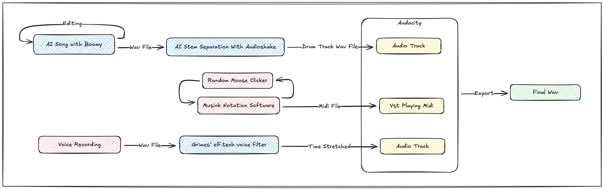

# Research Work Phase 1: AI Song Contest Analysis

## Part 1: Song Selection

I chose this song because it sounds kind of funny and because of the use of midi. It seems interesting that the song was made for AI listening rather than human listening. They say it's more of a collage rather then an ML project. they were inspired by grindcore, Lil B’s Afrikantis, and John Cage’s Music of Changes.

```
Team: Like the Atom
Song: Radiant Oasis in the Flimsy Banana Galaxy
Team Members: Ian Hudson, Desiree Davalos
Year: 2023
```

## Part 2: Technical Analysis

### ML Architecture

They used six off the shelf commercial models for the song, they used Boomy to generate music to later extract drums from. Boomy uses genera and sub genera to generate stems, and then you can edit those stems with the same app. They used Audioshake to split the drums out of the song made from Boomy. They also used ChatGPT to choose the virtual instruments playing the midi. They used the output of ChatGPT, and prompted Google Bard to get the title. They did not train a model or do any custom machine learning, but used the inference from the off the shelf models. They also used the Grimes elf.tech voice filter and timed stretched it, using it as ambience.

### Tool Ecosystem

They used mostly off the shelf solutions for most things, being more of a collage project. They used audacity to match the tempo and transients of the drums with the midi. They also used the notation program Musink with a random mouse clicker to get random melodies. For the AI models, they had no choice but to use the cloud services for their computation. It seems the integration was purely the audio and midi immigration that was built into Audacity.

### Data Pipeline

The data going into the Boomy web application was user form input, and then possibly changed using their application interface. They also time stretched a voice recording of them saying the title after processing it with the Grimes elf.tech voice filter. Everything AI related seems to be offline. In terms of feature engineering, they decided to purposely mangle data by prompting ChatGPT 23 times for random strings of words, then after this, they then prompted Google Bard with the most repeated words to get a title from random words, making the title with the response.

### Workflow & Process

They had three phases, the first the used Boomy and Audioshake to make the drum track. Then they used a random clicker to randomly the main melody. Then the final phase, they combined them in audacity with the possessed vocal. They tried to stay out of the process as much as possible due to the goal of making a song that AI would enjoy rather than humans would enjoy.



## Part 3: Musical Analysis

### Structure

Their song has very little form or structure. The song does end with a change of pace in the form of a modified vocal recording. Something that they do is have a consistent pace throughout the song, due to the way they got the random melodies. The song has a drone for the whole part made with the AI edited vocal recording, not doing much with structure though.

### Musical Elements

AI had very little role in the harmonic progressions due to the song not having almost any of them. But AI was used heavily in the drums and drum patterns. They also used AI heavily in creating the tone of the ambience on the background. Also, the midi instruments were chosen by prompting ChatGPT. Even though the musical structure had very little work, the sounds and sound selection were made to achieve the goal of making a song that a potential AI would listen to and not a human, and I think they succeeded at making me think a little about what an AI would listen to far in the future despite me not particularly liking the song. It is and interesting think peace.

### AI Signatures

What is interesting is that the most uncanny and AI sounding elements are the randomly generated parts using specifically not AI. But they did do this to create that uncanny feeling purposely. The drums, however, sound very normal, and actually quite processed, almost to a fault. I feel as if the drums, despite AI making them, sound overproduced and don't match the rest of the song. This shows that there is a limitation that the drums can only sound how the model out put them, and one cannot take of the processing because the “processing” on the drums are baked in.

## Part 4: Music Critic

### Comparative Analysis

It seems that they were trying to make music from the point of view of the technically illiterate. They were consumers of off the shelf products and did not have much control over what they made, but that was the goal in the message. Interestingly, because of their workflow, they also did not have automation at all either, because they had to manually put everything in audacity and time align it.

### Ethics and Aesthetics

They had no consideration on the training data that I can see. But they also did not even claim it's theirs, it was just a song that was made. They also did not consider the environmental impact that I saw in their description.

### Innovation Assessment

They did not have much to offer in terms of research and development, but they were trying to come at the project from a normal consumer point of view. The workarounds were quite crude, but that is what a tech illiterate person would do. It is an interesting observation into a non musician perspective of AI music tools and how they use them.

## References

- info on them
    - https://docs.google.com/spreadsheets/d/1ZzV0MdhRn0Apb0k03j52OlbP8nxwo2t4IRmOd8nSa-o/edit?gid=227254321#gid=227254321
    - https://www.aisongcontest.com/participants-2023/like-the-atom
- there tools
    - https://boomy.com/
    - https://musink.net/
    - https://www.murgee.com/random-mouse-clicker/
    - https://www.audacityteam.org/
    - https://indie.audioshake.ai/
