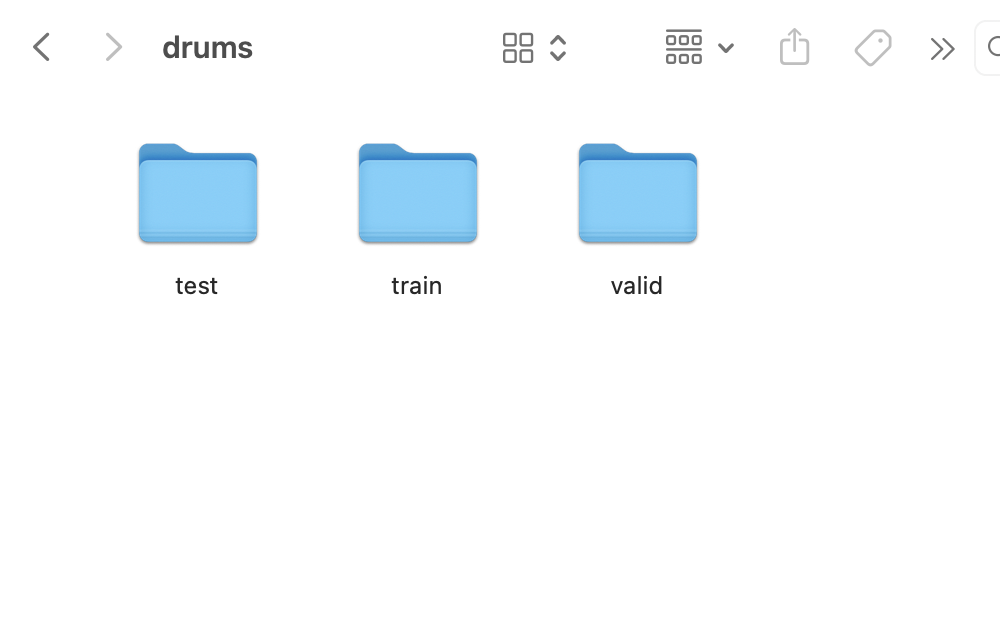

# Midterm: Using WavGan

## What I did

### Step 1
The goal of my project was to create a plunderphonics style piece using a modified version of WaveGan, built on datasets of easy listening music. 
This is something I am interested in continuing to do for my final project. For this stretch (this past week), I mainly focused on getting WaveGan to run with my current computer's CPU, with a provided dataset consisting of kicks, snares, hats, etc. 

The first thing I had to do was set up the environment for it to work in. PyTorch fortunately supports Apple Silicon via MPS (Metal Performance Shaders), so I downloaded Conda (Miniforge). MacOs uses zsh as its default interactive shell, so I had to manually initialize conda. This was done with the command:

`~/miniforge3/bin/conda init zsh`

Once I had sorted that out, I created and activated my environment with these commands.

`conda create -n wavegan python=3.8 -y.`
`conda activate wavegan`

After running these commands, my terminal looked like this which indicated wavegan was running:

The next step was to install the Mac-Optimized PyTorch. The pip command is the standard package manager for Python, used to install and manage software packages not part of Python standard library. 

`pip install torch torchvision torchaudio`

Afterwards, I cloned Mostafa Elaraby's PyTorch port of WaveGan. The reason I used this and not Chris Donahue's original WaveGan was because it was written back in 2018 using TensorFlow 1.12. This version does not run natively on Mac hardware, and I would need to run it through an x86 emulator (like Rosetta 2). The code would also run entirely on my CPU instead of my GPU, and what usually takes a few hours would probably take weeks, which isn't viable when I'm trying to hit a deadline for this class.

Elaraby's version is written in PyTorch, which as mentioned supports MPS. This allows us to use my Mac's graphic processing power. PyTorch in general is also much easier to read, debug and modify than TensorFlow 1. After that it was just installing some dependencies

`pip install numpy scipy tensorboard`

This completed my environment setup and I was ready to start feeding it the drums (or so I thought).

### Step 2

Afterwards, I installed `drums.tar.gz`, which was a dataset consisting of thousands of kicks, drums, claps, snares and etc. In my newly created wavegan-pytorch directory, I created a new folder structure so that the path would look like this:

`wavegan-pytorch/data/drums`

I then extracted my downloaded dataset and put it into drums folder. This is how it looks like after I did that. 

Out the box, the repository is hardcoded to look for NVIDIA GPUS, and would naturally default to my CPU. To avoid this, I went into the train.py file and changed this line:

`device = torch.device("cuda" if torch.cuda.is_available() else "cpu")`

I deleted cuda and replaced it with mps, so that it would use my Mac's Metal Performance Shaders. Another thing I had to change was the code so that it pointed towards my dataset, as the original code was directed towards the owners original dataset.  Once I did that, I went into the terminal and ran this command to start the training proccess. 

`python train.py --data_dir data/drums`

### Step 3

As I tried to start the training proccess, I was hit with a series of Module errors. There are so many dependencies on this WaveGan that I wasn't aware of, which lead to the most time consuming part of this proccess. However, as a result I got to see some of the required components that made WaveGan run. An example of this is having to install librosa, which is a Python library for audio and musical analysis.  Another was matplotlib, which was most likely used to draw visual graphics of the training progress to generate spectrogram images of audio as the GAN trains. After that, I had to install soundfile because the developers of librosa deleted their librosa.output module years ago.Soundfile acts as the modern standard for saving audio in a library. After this, I replaced the line:

'librosa.output.write_wav(filepath, audio, sample_rate)'
with 
'sf.write(output_path, sample, 16000)`

After this, made it onto the actual training loop. The first few files that were outputed were very harsh static. Here is an examples of how it sounded:

<audio controls>
  <source src="1.wav" type="audio/wav">
</audio>

I assumed that everything was going fine until a few hours later, it would continuously output silent files. Furthermore, this proccess was draining my laptop's battery super fast, and as I was trying to work on other assignments I started to lose 1% every 30 seconds or so. I knew this was not practical, so it was time to move it into Colab.

### Step 4

In my Google Drive, I duplicated my wavegan_data folder and put all the dataset wav files into the train folder. Then, in google colab I created a new notebook, changing the runtime setting so that I would be using a NVIDIA T4 GPU. I then connected it to my drive through this code:

`from google.colab import drive
drive.mount('/content/drive')

!git clone https://github.com/mostafaelaraby/wavegan-pytorch.git
%cd wavegan-pytorch
!pip install soundfile`

One of the good things about colab is that torch, matplotlib, librosa and other dependencies are pre-installed, so I didn't have to run into so many issues this time around.However, some dependencies like pescador were not (pescador is a library used for streaming data, which is how the code feeds the audio into the GAN). While using colab (it's still in proccess at the time of this presentation being given), it is going through the training epochs significantly faster and not draining on my battery. Now that I have this properly setup and working, the next step will be to curate my own datasets and feed them into colab for the final project of this semester.

## How machine learning is involved

WaveGAN operates using a specific type of machine learning called a Generative Adversarial Network (GAN). There are two different neural networks, a generator and a discriminator and the generator is trying to generate authentic fakes while the discriminator is listening to the real dataset and the fakes and guessing which is real. At the very start, the generator is terrible at its job and the discriminator can easily spot the fakes. However, each time the generator gets caught it will learn from its mistakes and improve. Over thousands of epochs (rounds), the generator gets so good the discriminator can't tell the difference and that's when the model is successfully trained.

## What I learned/new skills acquired/understanding developed

Through this proccess, I learned a few things:

- How to set up an environment with Conda so the dependencies don't conflict with each other
- Understanding the difference between CPU and GPU computing, and learning how to reroute older hardware commands to utilize the MPS of Apple
- Although not fully confident, I got better at troubleshooting. This includes finding the missing dependencies and swapping out old functions. 
- Learning how to migrate a heavy workload onto a cloud (Google Colab), and succesfully mounting datasets using Google Drive.

## Reflection

This was a frustrating proccess for the most part, but it helped me understand some of the underlying mechanics to how it computes data. Moving the project onto Colab and having it out of sight out of mind was particularly rewarding. Now that the technical pipeline is fully working, I am ready to start curating my datasets for the final project.