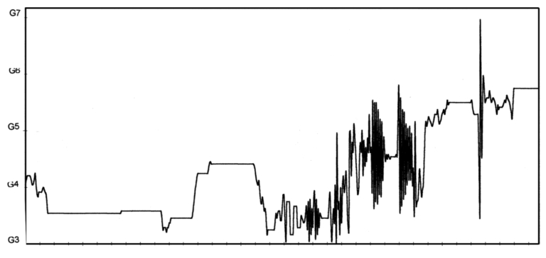

# Random Walk Composition
## Introduction

As of late, I have become very interested in the compositional work of Iannis Xenakis. Xenakis is known for taking various parameters of music and formalizing them using a mathematical structure, typically stochastic in nature. While he states that everything is subject to the musical judgement, he uses these laws to "eliminate prejudical positions" (removing biases).

In mathematics, a random walk is a process that describes a path that consists of a succession of random steps on some mathematical space (e.g. 2D, amplitute-time, pitch-time). This concept was introduced by Karl Pearson in 1905. A simple way of visualising it is having an interger number line starting at 0, and each step moves by +1 or -1 with equal probability. Another example, known as Brownian motion, is recording the path traced by a molecule as it travels in a liquid or gas.

Xenakis became interested in random walks in the 1960s. Prior to this, Xenakis was using stochastic processes to control smaller events such as notes, their duration etc. It occured to Xenakis that these two concepts could be applied together by mapping these stochastically created waveforms onto a piece of sheet music (pitch-time). His first attempt at this was Mikka (1971)

<audio controls>
  <source src="mikka.mp3" type="audio/mpeg">
</audio>

Mikka is a single sound that is unfolding continuously throughout the piece, mapping the randomly generated output onto the glissandi.

The important thing to realize is that a mathematical shape is just a shape. It doesn't matter regardless of it's being used to adjust the timbre or decide the melody of a sheet of music.

## Algorithm

A "random walk" algorithm decides the next note based entirely on the current note, plus a random step in a given direction.

Using the whole-tone scale (C, D, E, F#, G#), the algorithm will roll a 6-sided die. 
- If it roles 1 or 2, it will step down one scale degree. 
- If it roles 3 or 4, it will stay on the same pitch
- If it roles 5 or 6, it will step up one degree.

There will be another 6-sided die used to determine the duration. 
- If it roles 1, 2 or 3 it will be an eighth note.
- If it roles 4 or 5 it will be a quarter note.
- If it roles 6 it will be a half note.

## Proccess

I first installed MIDIUtil in through terminal.

### Import 
Next I imported Python's random number generator, which will be used to roll the virtual dice. I also imported the tool from MIDIUtil to build MIDI files.

I then defined the pitch pool (scale_midi). MIDI uses numbers for notes, Middle C being 60, D is 62, E is 64, etc. Every note is 2 steps apart because I am using the whole tone scale.

### MIDI track
I then defined the function with "def generate_stochastic_midi", giving it default values. It will generate 32 notes unless told otherwise.

"midi = MIDIFile(1)" creates a blank MIDI file in the computer's memory with exactly 1 track.

I then set up the defaults for the track, and embeded some metadata into the the start of the file.

### Starting it off

By stating "current_index = 6", it starts in the middle of the scale_midi list. Index 6 means the 7th item in the list so it points to the number 72, which is an octave above middle C.

### The for loop

I then created a for loop by stating "for _ in range(num_notes):". This loop will repeat 32 times. Everything underneath it happens for a single note.

There are two parts to the following step: the pitch and the rhythm. 

#### Pitch
"pitch_roll = random.randint(1,6)" creates a 6 sided die. If it rolls a 1 or 2, it subtracts 1 from the current_index. The "max(0, ..." parts act like a safety net, preventing the index from dropping below 0. If it dropped below 0 the program would crash because there are no negative indexes in our list.

The "min(..)" part acts like a ceiling to stop the index from going higher than the length of the list. "scale_midi[current_index]" grabs the MIDI number from the list.

#### Rhythm
Just like for pitch, 6-sided die is used to decide the rhythm. There is a 50% chance it will be an eigth note, 33% chance it will be a quarter note and 16% chance it will be a half note.

### Converting to MIDI and playhead
"midi.addNote(...)" takes all the variables calculated and stamps the note into the MIDi file memory. "time += duration" acts like a playhead, making sure the next note generated in the loop doesn't play at the same time as another note, but after it finishes.

### Saving to disk

Finally, once the loop generates 32 notes, the code opens a new file on the hard drive. "midi.writeFile" dumps all the data from the computer's memory onto that file, and prints a success message.

## Editing 

I ran the code 8 times, generating 8 melodies. Afterwards, I loaded them in Logic and placed them over each other. I loaded in a keyboard sound I liked so the melodies could be heard. Afterwards, I allocated 2 of the generated melodies +12 semitones higher, 2 of them -12 semitones lower, and 2 of them -24 semitones lower.

