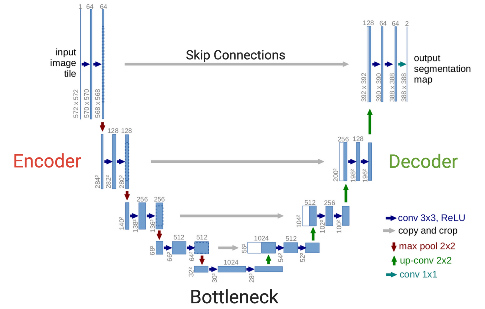

## What is it?

Suno is a generative artificial intelligence music creation platform. It launched in December 2023, and since then has developed into a DAW that can generate vocals and instrumentation. 

The way it works is that it is a prompt-based tool. You enter a description, for instance: "moody pop song about unrequited love", and Suno will analyze the text and create lyrics, melody, harmony and rhythm.

Once generated, users can extend the songs and add new sections to build longer songs, or alter the contents by replacing sections, adding vocals, etc.

## What is the underlying technology?

Audio generation is achieved in two main ways; through MIDI and through Audio Waveforms. MIDI generation is a low computational cost and can provide high quality outputs, as you can then run it through VSTs to produce the sound. Audio waveform generation works through diffusion, which refers to the proccess of removing noise from a signal. Forward diffusion adds noise and reverse diffusion removes it. These models take white noise and go through a "denoising" process until it resembles something recognizable, like a sculptor working with a block of marble.

At the core of an audio diffusion model is the U-Net. The U-Net consists of an encoder and a decoder, connected by the bottleneck.  The audio data enters the top left side of the U, following the arrows through the right side. Each blue rectangle represents a model layer. During each level of the encoder, the audio signal is compressed further and further until it reaches a highly condensed representation of the sound. The decoder then takes this signal and reverses the proccess to reconstruct the signal.

Each layer has a series of adjustable weights that tweak the compression/reconstruction proccess. This allows the model to learn a range of features from things such as melody and rhythm to timbral characteristics.

Connecting this to the noising/denoising concept, the model is first taught how to add noise to a signal. Once it learns this it inherits the inverse of denoising the signal.

The noising proccess follows almost exactly the same proccess as the U-Net, but instead of reconstructing the exact audio signal, it is directed to reconstruct the input audio with a small amount of noise added to it. This noise follows a probabilistic distribution, meaning that it follows a specific pattern that is predictable.

This slightly noisy sample is provided to the model again, and instructed to reconstruct this sample with even more noise. This repeats over and over until it's just white noise. Once it becomes an expert at adding noise to the signal, it is then reversed so that at each step a little noise is removed. 

When given a wide range of sounds in a dataset, it learns to create sounds similarly to what it's trained on, but not exactly.

What this also means is that no model can replicate human creativity, just create variations of it.

