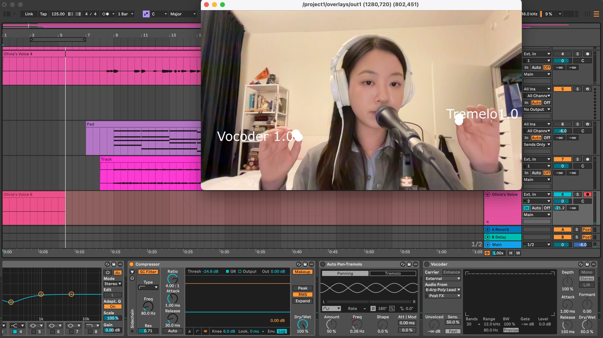
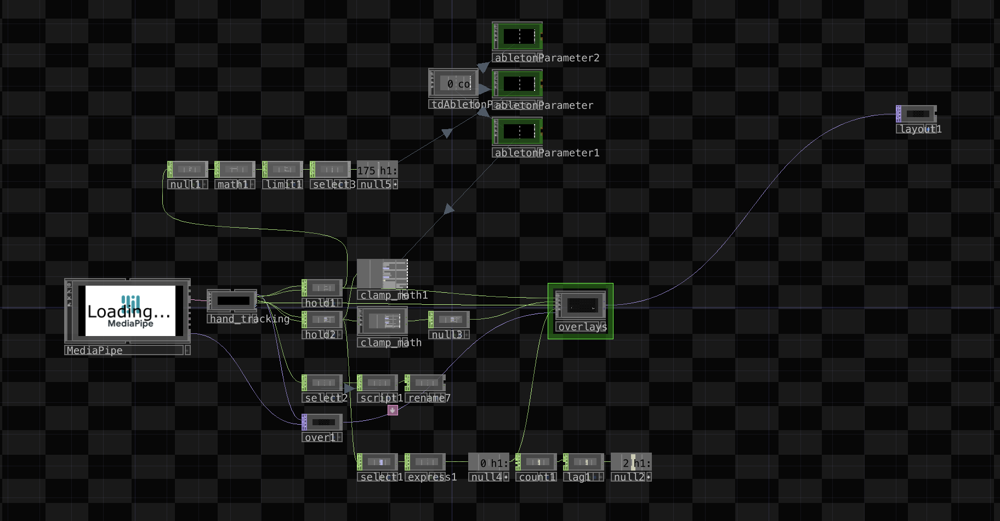
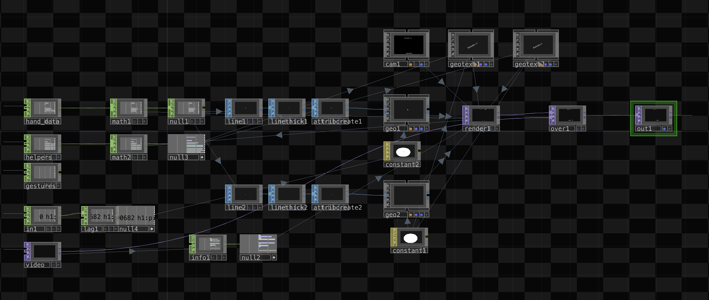

## Final Project

### 🔗 Project Assets Link

Hello Professor! 

Please Click [here] (https://drive.google.com/drive/folders/1WzZEVNZPFV0pgn5Y8AluJAlzz54RjK1i?usp=drive_link) to download and view my final project video and other project assets.

Thank you!

### 📚 What I did for my project?

For my final project, I integrated MediaPipe, TouchDesigner, and Ableton Live to create a live audiovisual performance based on my remix of the song Birds of a Feather. The project focused on using real-time hand-tracking as a performance interface to control vocal effects during a live singing performance. Instead of relying on traditional MIDI controllers or manual automation, I explored how gesture-based interaction could become part of the musical performance itself.

The live vocal effects used in the project included auto-pan/tremolo and vocoder processing. Through TouchDesigner and Ableton Live, I mapped several performance parameters to hand-tracking data, including device on/off states and tremolo frequency control. 

### ⚙️ How machine learning is involved
Machine learning plays a very important role in this project through the use of MediaPipe’s hand-tracking models. MediaPipe uses computer vision and machine learning algorithms to detect and track human hand landmarks in real time through a webcam feed. 

It continuously analyzes the webcam image and outputs positional tracking data such as finger coordinates, wrist position, and gestures. This data is then transferred into TouchDesigner, where it can be processed and mapped to musical parameters inside Ableton Live.

What interested me most about this process is how machine learning help transform computer vision technologies and extend traditional live performance practices and create more interactive forms of music.

### How you implemented the project
The first stage of the project involved learning the fundamentals of TouchDesigner. Since I had no previous experience with the software, I spent a significant amount of time studying the interface and workflow through YouTube tutorials and online documentation. After becoming more comfortable navigating the software, I found a very useful GitHub project developed by **Torin Blankensmith** that integrates MediaPipe directly into TouchDesigner : )

According to Torin's GitHub descriipbtion, this plugin loads MediaPipe models through a web browser environment embedded within TouchDesigner. The machine learning models are downloaded locally and stored inside TouchDesigner’s virtual file system, allowing the component to operate without an internet connection. The models run using WebAssembly, while the tracking data is transferred into TouchDesigner through a local WebSocket server running internally within the software. This setup allows the MediaPipe component to function as a standalone `.tox` file with GPU acceleration and minimal additional configuration.

Then I established communication between TouchDesigner and Ableton Live using **TDAbleton**. TDAbleton is a framework that enables bi-directional communication between the two programs through Ableton’s MIDI Remote Script system, OSC communication, and Max for Live devices. This allowed TouchDesigner to both read and control parameters directly inside my Ableton Live session. Setting up this communication chain required installing the TouchDesigner TDAbleton package, configuring OSC communication, and creating corresponding connections inside Ableton Live’s Master Track. 

MediaPipe provide both raw positional data and processed helper data such as pinch distance measurements. I experimented with many different tracking values and gestures before deciding on three main controls: hand 1 pinch distance, hand 2 pinch distance, and wrist 1 vertical (Y-axis) position.

One of the most important parts of the implementation process was processing and smoothing the tracking data so it could control musical effects reliably. Raw hand-tracking data is often unstable and contains small fluctuations that can create unnecessary parameter movement inside Ableton Live. To solve this issue, I created a series of Math operators inside TouchDesigner to scale, clamp, and limit the positional data. I adjusted the value ranges very carefully so that the controls would remain responsive and stable enough for musical use.

For example, I mapped wrist height to effect activation and tremolo frequency, but I noticed that decimal values and unstable tracking caused inconsistent triggering behavior. To solve this, I implemented threshold-based logic using either/or conditions within the Math operators so the system could interpret gestures more clearly as binary on/off states when needed.

I also spent a considerable amount of time adjusting the physical interaction range of the system. If my hands moved too close to the edge of the webcam frame, MediaPipe would occasionally lose tracking. Additionally, during longer takes, I unconsciously lowered my arms due to fatigue, which affected the consistency of the control data. As a result, calibrating the tracking range and sensitivity became a crucial part of the project. Ensuring that the data remained stable and musically usable was essential for creating a convincing live performance experience.

After the technical setup was complete, I focused on performance practice. Since the gestures directly controlled live audio effects, I had to develop coordination between singing and hand movement simultaneously. The final stage of the project involved rehearsing these movements repeatedly and recording the final performance video with both TouchDesigner and Ableton Live running together in real time. 

### 🤔 What I learned

One of the biggest things I learned from this project was how complex real-time interactive systems can become once multiple software environments are connected together. Before this project, I mainly viewed music technology from the perspective of audio production and live sound engineering. This experience introduced me to a incredible new workflow involving machine learning, computer vision, data processing, and interactive media design. I also gained a much deeper understanding of TouchDesigner’s workflow and learned how powerful it is for audio and visual implementation. 

Another major takeaway was the importance of data processing in interactive performance systems. Raw data is not automatically performance-ready. Even small fluctuations in positional tracking can dramatically affect musical control. I learned that smoothing, clamping, scaling, and filtering data are just as important as the tracking model itself.

### 📒 Reflection: challenges, unfinished work, and what you would change

One of the earliest challenges I encountered was simply running the MediaPipe TouchDesigner plugin reliably. The system required a large amount of processing power and storage capacity, which caused long loading times and occasional instability on my laptop. So I had to delete several large projects in order to free up enough capacity for TouchDesigner to operate properly.

The project was also extremely CPU-intensive. During my experimenting phase, my laptop would become very hot, and the hand-tracking data would begin to lag or respond with noticeable delay. This directly affected the responsiveness of the musical controls. In many cases, the issue could only be resolved by closing the programs temporarily and allowing the computer to cool down before restarting the system.

Another major challenge was designing the visual interface inside TouchDesigner. Beyond the technical hand-tracking system itself, I wanted the interface to communicate clearly what parameters were being controlled during the performance. Learning how to create custom text overlays, visual indicators, and CHOP references inside TouchDesigner took much longer than I initially expected. Since TouchDesigner’s workflow is highly node-based and procedural, even relatively simple interface elements required careful experimentation and troubleshooting.

If I had more time to continue developing this project, I would expand the number of gestures and parameter mappings. I would also spend more time refining the performance aspect itself so the gestures feel more natural and intentional during singing.

One issue I would especially like to improve is hand identity tracking. In the current system, if one hand leaves the webcam frame, the remaining hand can occasionally take over the previous parameter assignment. This creates inconsistencies during performance. In the future, I would like to explore methods for permanently assigning controls to the left and right hand independently so that the system behaves more reliably in live situations.

Overall, this project was a rewarding one. It pushed me outside of my comfort zone and introduced me to new areas of music technology that I had never explored before. Although the system is still far from complete, the experience gave me a strong foundation for future experimentation with machine learning, interactive media, and live performance technology.

