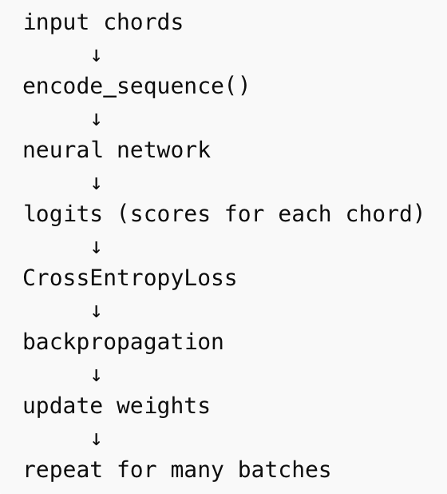

# Lab 4: Neural Networks in PyTorch

## 1. Study Process Overview

*[Describe how you used AI to study `nn_3.py`. What questions did you ask? What did it help you understand?]*

For this assignment, I went down the deep rabit hole of trying to understand each line of the code thoroughly. Based on a first look at each code section, I took notes on what is unfamiliar and confusing, and went to use ChatGPT for some explanation on terminology, syntax, and the function/purpose of the code. Initially, I tried the Google Gemini extension inside VS Code, but it reacts very slowly and it wasn't helping my study workflow. So I went back using ChatGPT which is much faster. AI tool really helped me correct my language and understanding of each block of the code. Sometimes I couldn't differentiate code parts like instance, parameter, argument, function, class, etc, and so it would help me clarify the why and how it is used within context. Usually a question leads on to another, so I found myself working quiet slowly through this assignment because so much of the Python language used here is new to me. I also made this assignment almost like a notebook for myslef and I put in newly learned syntax and vocabulary definition to help me get more fluent with Python hopefully in the future : )

## 2. Understanding Inventory

### What I Understand

[For each part, write 2–3 sentences explaining it in your own words.]

***Step 0: Imports and Configruation***

* Learned a bit more about the origin and structure of `Torch`, which is an earlier deep learning framework written in Lua, while `PyTorch` is the Python version of `Torch`. The name reflects the Python interface, but the core is not Python because the core engine is written mostly in C++ (runs heavy numerical operations). Python is mainly used to control and orchestrate the computation. 
* `Kernel` = n. the execution engine that runs code = 核心程序
* `Pandas` is a Python data analysis library used for handling structured data. It provides two main data structure: Series and DataFrame. 
* `torch.manual_seed(42)` I learned that this is a function inside the torch module that sets the seed of the random number generator.
* `Seed` is a starting value of a pseudo-random number generator. Computers do not generate true randomness. Instead they generate numbers using deterministic formulas like: `xₙ₊₁ = (a xₙ + c) mod m` If you start with the same seed, you always get the same sequence. Because we are forcing PyTorch’s random number generator to produce the exact same sequence of “random” numbers every run. Setting a seed makes experiments reproducible.
* `Gradient Descent` is the main method used to train neural networks. It means repeatedly adjust parameters to reduce prediction error.
* `Loss` measures how wrong the model is: prediction vs true answer. Weights gradually change until prediction error is small.
* `Cross-Entropy Loss` calculates the penalty, while `Gradient Descent` then adjusts weights so that next time the correct answer's probability increases.
* `Dataset Shuffling` is important because it prevents the network from learning patterns that depend on the order of the dataset rather than the data itself.
* An `Epoch` is complete pass through the entire training dataset.
* Training Pipeline:  

***Step 1: Load Data and Build Vocabulary***

* This section organize and clean the data in a way that's more useful for training our model.
* `.extend` is different from `.append` because `.extend` adds each element of an iterable individually to the list, while `.append` adds the entire object as a single element (nested list).
* `stoi` = string to integer; It creates a dictionary by looping over CHORDS and assigning an index to each chord. It stores key-value pairs. This dictionary is very important because neural networks can't process text or chords; They can only operate on numbers.
* `enumerate()` is a function that adds an index counter to a iterable.

***Step 2: Encoding***

* A `token` is the smallest unit of data that a model treats as a symbol (it could be words, a few ms of audio, MIDI messages, etc).
* `torch.zeros` is a function that creates a new tensor (a multi-dimensional matrix) filled entirely with the number 0.
* I learned that variable names in Python do not matter, but they must match the variables created in the loop.
* `.flatten` converts the 2D matrix into one long vector. Then, this very long vector is fed to our fully connected neural network.
* `def decode(logits_or_onehot)` tells me that the model can output one signle prediction or multiple predictions. One prediction = a vector with 10 parameters of each chord's score/logits; Multiple predictions = a matrix of (x, 10) parameters.
* `.dim` gives us the number of dimensions of a tensor.
* `torch.argmax()` gives us the index of the largest value. It stands for argument of the maximum.
* `idx` is a tensor of chord indices not a list!
* `.item()` converts the tensor into a normal integer. I learned that PyTorch numbers are stored as tensor objects, not plain numbers. And that Python lists require normal integer for indexing.
* `dim = -1` means the last dimension, which in this case of a 2D multiple predictions tensor like [batch, vocab], the last dimension is vocab. So the model operate along the last dimension of the tensor and compute argmax across each vocab row.
* List Comprehension Syntax: `return [CHORDS[i.item()] for i in idx]`  Python allows loops to be written inside brackets when building a list. Similar example: `[x*2 for x in [1,2,3]]`

***Step 3: Build Training Pairs (Sliding Window)***

* Training example: Nexample​ = Length − Window Size
* `i:i` is Python's slicing syntax. Generally it slice from: `list[start : end]` Notice that start index is inclusive, while end index is exclusive.
* This part is also another example of list comprehension.

***Step 4: Encode and Split***

* `_` is just like a normal variable, but we do not plan to use it.
* Tuple Structure: `[first_element, second_element]`
* `torch.ranperm` shuffle the dataset
* `permutation` = n. 数列、置换
* DataLoader manages mini-batch training

***Step 5: Define the Model***

* A `class` is a blueprint for creating objects.
* `nn.Module` is the base class for all neural networks in PyTorch.
* `__init__` is a special method in Python classes called the constructor. It is the same as calling `nn.Module.__init__` which initializes the internal PyTorch machinery. If this line is omitted, PyTorch cannot properly detect model parameters.
* `Super` refers to the parent class. Historically, in object-oriented programming, parent class = superclass, children class = subclass. Therefore `super()` call methods from the parent class.
* `nn.sequential` is a container module. It means run layers in order from top to bottom. Without this function, we would need to manually call layers one by one.
* Math Equation: `y = Wx + b` ; target = weight * input vector + bias vector
* `ReLU` = Rectified Linear Unit
* `.numel()` = number of element
* `self.net = nn.Sequential(...)`
* <pre>
model
└── net
       └── Sequential
          ├── Linear
          ├── ReLU
          └── Linear
</pre>

***Step 6: Train***

* `top_k=4` returns the top_k most likely predictions. Means if the caller does not specify it, use 4.
* `model.eval()` switche the neural network into evaluation mode. It disables training behaviors.
* `torch.no_grad` disables gradient tracking and save memory usage and speed up computation.
* `Gradient Tracking` is a mechanism PyTorch uses to record operations so gradients can later be computed.
* `with` This syntax temporarily changes some behavior while the block executes. In our context, it disables gradient tracking inside the block and restore normal behavior after the block.
* `.unqueeze()` is a method from PyTorch. It's function is to add a new dimension of 1 to a tensor. The number (0) tells where to insert the new dimension (in this case at position 0).
* `torch.softmax()` is a function from the torch module.
* `for prog in test_progressions:` this loops sends one single example at a time, so the data is not considered as a small batch of data. Therefore, `.unqueeze` needs to add another dimension of 1 for the single example.
* `.join()` takes many strings and concatenates them into one string, inserting the separator between them.
* `.0%` number of decimal places. Converting the previous number into probability.
* `torch.optim` is the optimization module in PyTorch. It contains algorithms that adjust neural network weights.
* `Adam`= Adaptive Moment Estimation, is a popular, highly efficient optimization algorithm used in machine learning to update network weights during training. 
* `lr` = learning rate: it controls how big the weight updates are.
* `.step()` tells the optimizer to update the model weights using the gradients.
* `model.train()` switch back to training mode
* `.parameters()` return trainable weights
* During the training process: <pre>
 ├── 1.The model makes a prediction.
 ├── 2.The loss function measures how wrong it is.
 ├── 3.Backpropagation computes gradients 
 		(how each weight contributed to the error).
 ├── 4.The optimizer uses those gradients to change
 		 the weights.</pre>

* Syntactically, these are all methods of objects, not standalone functions:

* More detailed training steps:<pre>
 ├── 1. `optimizer.zero_grad()`
 		   clear gradients
 ├── 2. `predictions = model(X_batch)`
 ├── 3. `loss = loss_fn(predictions, y_batch)`
 ├── 4. `loss.backward()`
 		   compute gradients
 ├── 5. `optimizer.step()`
 		   update weights </pre>

***Step 7: Evaluate***

* `Boolean Mask` s a vector/or tensor of True and False values used to select specific elements from another tensor. Example:
`y_test = [0, 2, 0, 1, 0]` 
`mask = y_test == 0`  
Result: `mask = [True, False, True, False, True]`
* In this section, the loop goes through every chord in CHORDS and measures how often the model correctly predicts that specific chord.

***Step 8: Predicte***

* This section is actually testing the trained model on a few random example chord progressions and prints the predicted next chord probabilities in a readable format.

### What I Don't Understand

[List specific parts that remain unclear. Include concrete questions. Write 2–3 sentences per gap.]

* What is a seed and why does it matter? Additionally, what are the potential trade-offs or limitations of changing a seed? 
* Where are randomness implemented in the process of training a neural network? (weight initialization, dataset shuffling, mini-batches)
* What is Gradient Descent? How does it adjust model's parameters to minimize loss?
* In generative models, where there is no single 'correct' answer, how is the error or loss function actually defined and calculated to guide the learning process?
* Why do we need hidden dimensions in a neural network model? Is that why `nn.Linear` is used twice in step 5? What are the things to consider as programmers when choosing the size of the hidden layers?
* Why is `.unqueeze()` needed during testing? How does it connects with the input or output of the model.
* Why does the neural network produce nearly uniform probabilities across all chord classes before training begins? What aspects of random weight initialization and the softmax function cause the predictions to appear evenly distributed?
* Does high accuracy indicate that the model can produce musically convincing or creative chord continuations, or does it only show that the model can reproduce patterns that already appear in the training data?

## 3. Model Limitations

[Identify at least 2–3 limitations. For each: name it, explain why it matters, and optionally suggest improvements. 2–3 sentences per limitation.]

1.Small Vocabulary

The model predicts from a small and simplified set of chord symbols. It ignores richer harmonic possibilities such as secondary dominants, tensions, and modal interchange chords, which limits musical lense. An improvement would be expanding the vocabulary to gain a full representation of harmony, possibly including more chord qualities, inversions, or extensions.

2.Window Size

The model only sees the previous four chords when predicting the next chord. This restricts the musical context and may prevent the network from learning longer harmonic structures such as phrase-level cadences or modulations. A possible improvement would be using a longer window sizes that can capture longer-term harmonic tendencies.

## 4. Improvement or Experiment

[Describe what you changed and what you learned. Write at least 2–3 full sentences.]

I experimented with several training parameters to observe how they affect model performance. Changing the number of epochs showed that both too few and too many training passes can hurt performance. When I reduced the epochs to 5, the model was likely undertrained and did not fully learn the chord patterns. Increasing to 15 epochs did not improve accuracy either, suggesting diminishing returns and possible overfitting.

I also tested different hidden layer sizes. Increasing the hidden dimension slightly improved performance at 30, which suggests that a larger hidden layer can help the model capture more complex relationships in the chord progressions. However, the improvement was small, indicating that model capacity is not the main limiting factor.

Finally, changing the learning rate had the biggest effect. When the learning rate was too high (0.1), the model changed its weights too aggressively each step, which made it hard for the training process to settle on a good solution. When the learning rate was too low (0.0001), the model updated its weights very slowly, so it did not learn enough during the training time. This shows that the learning rate needs to be in a reasonable middle range so the model can improve steadily.

## 5. Creative Possibilities

[Describe at least one idea you would want to explore further.]

One idea I would like to explore further is whether the model can learn longer harmonic structures instead of only looking at the previous few chords. In reallife music, chord progressions often depend on phrases and tonal center movement, not just the immediately preceding chords. It would be interesting to test a model that can remember longer sequences, such as using a longer input window or a sequence model, to see if it produces more musically convincing results.