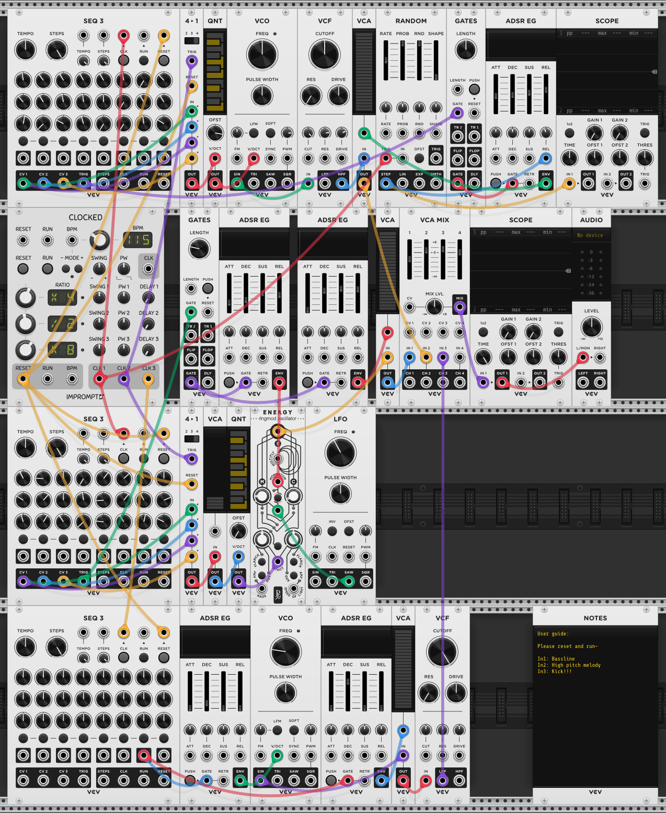

# Lab 5: Symbolic Music Generation 

For this lab, I took a slightly different approach. Instead of producing audio or MIDI directly, I built an algorithm that generates a sequence of note names. I then converted those notes into control voltage values and used them to drive a step sequencer in a modular synthesis environment (VCV Rack 2). This separates the compositional from the sound creation stage, giving me more flexibility in shaping the final output.

### My Algorithm

<pre>NOTE_NAMES = ['C', 'C#', 'D', 'D#', 'E', 'F', 'F#', 'G', 'G#', 'A', 'A#', 'B']

MIN_MIDI = 12  # C0
MAX_MIDI = 96  # C7 </pre>

It generates a sequence of 24 notes drawn from the chromatic scale across a pitch range of C0 to C7. I originally set a much narrower range, but the results quickly felt too limited and repetitive. When too many notes cluster within the same octave, the pattern tends to sound static and predictable, so expanding the register gave the sequence more contrast and a stronger sense of movement.

I also chose to keep the range broad enough to include pitches even beyond human hearing (like C0). In the context of my modular setup, those extreme frequencies can become useful musically because once the oscillator is shaped with a filter, some of these inaudible pitches can function more like rests within the sequence. That gave the algorithm another layer of variation while also creating more spaces.

<pre>def midi_to_note_name(midi_number):
    note = NOTE_NAMES[midi_number % 12]
    octave = (midi_number // 12) - 1
    return f"{note}{octave}"

def generate_random_notes(length=24, min_midi=MIN_MIDI, max_midi=MAX_MIDI):
    pattern = []
    for _ in range(length):
        midi_note = random.randint(min_midi, max_midi)
        note_name = midi_to_note_name(midi_note)
        pattern.append(note_name)
    return pattern

pattern = generate_random_notes()

print("Generated 24-note pattern:")
print(" ".join(pattern)) </pre>

* After a MIDI note is generated within this range, the MIDI note value is then converted into a note name + its octave. 

`D2, A#-2, C4, C-6, F6, D#7, D1, C4
F-1, A#6, C4, F#3, F#-2, G6, D2, F9
B2, D6, A1, D#-4, F#-2, B1, A4, G#-1`

* Additionally, I added another step that transform note name into control voltage value that can be used in my VCV Rack. I first assign each pitch to their corresponding chromatic scale number from 0 to 11. Then it separates the note into two parts: the pitch name and the octave number. Next, I calculate the MIDI note number using this formula:

`(octave + 1) * 12 + semitone`.

* Once the note has been turned into a MIDI number, the algorithm converts that MIDI value into control voltage value. MIDI note 60, which is middle C4, is represented as 0 volts, and every octave above or below it changes the voltage by exactly 1 volt. Therefore, moving up one semitone raises the voltage by 1/12. Finally, it will produce a full sequence of voltages that can be used directly in my step sequencer.

`CV = (MIDI − 60) ​/ 12`
`[-1.735, -5.928, 0, -10, 2.482, 3.205, -2.627, 0, -3.831, 2.795, 0, -0.530, -6.241, 2.602, -1.783, 4.434, -1.060, 2.121, -2.193, -8.892, -5.615, -2.072, 0.867, -4.241]`

### Musical Editing

To convert the algorithm’s output into audio, I used VCV Rack as the sound generator. Since the algorithm output spans a very wide pitch range and contains random chromatic notes, the raw result was often too unstable to sound musical on its own. To give the material more coherence, I quantized the voltages into a minor pentatonic scale. This kept the melodic line and spacing of the generated pitches, but filtered them through a more constrained harmonic language that made the sequence feel more listenable.

The control voltages produced by my algorithm were then entered into my VCV Rack patch and used to drive the oscillators as pitch information. From there, I built out the rest of the patch to shape how those pitches were actually heard over time. I used envelopes, gates, VCAs, filters, sequential switches, and additional modulation modules to control the rhythm and articulation of the sound. To give the piece a stronger pulse and make it feel more grounded as a sequenced pattern, I also added a kick drum sound. This rhythmic layer helped pushed my result closer to the feel of a step sequencer or drum machine performance.

