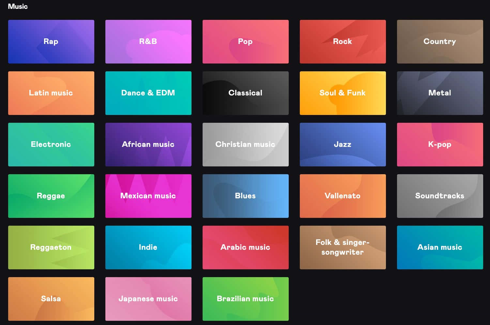
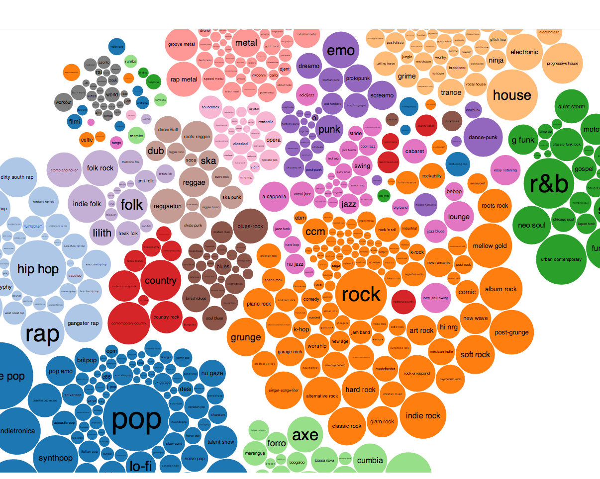

#### 🤔 *How Does SUNO Understand and Recombine Musical Genres?*

## Midterm Project Prposal

### What I Would Like to Do

For this project, I want to investigate how SUNO represents, interprets, and recombines musical genres. From my experience, SUNO can generate pretty convincing music in many styles, but I'm curious does it truly understands the musical characteristics of those genres and how it learns statistical patterns/traits from training data.

***My goal is to test SUNO’s understanding/stereotype of genre in several ways:***

1. Identify the musical “DNA” of different genres by analyzing common features in SUNO-generated tracks.

2. Test whether SUNO can combine very different genres into cohesive hybrid styles.

3. Evaluate how well SUNO reproduces non-Western or culturally specific genres.

4. Examine how Berklee listeners perceive these outputs and whether they can correctly identify the intended genre.

5. Explore how SUNO behaves when given contradictory or impossible genre instructions.

### How I Will Do It?
First, I will conduct a series of small experiments using SUNO prompts that target different aspects of genre generation.

* Generate many songs with genre specific prompts like:  UK Garage, New Jack Swing, Afrobeat, City Pop, etc.

* Analyze recurring musical features: 
BPM, Drum Pattern, Instrumental Choices, Vocal Style, and Chord Complexity

This will help determine what musical elements SUNO associates with each genre.

Second, testing cross-genre combinations. For example, I would use prompts like: Baroque opera with trap drums. This will allow me to see whether SUNO can successfully blends the genres or if one genre dominates the output.

Third, I will test cultural authenticity by prompting SUNO to generate non-western music styles which has scales and instruments that's maybe less represented in a modern pop-industry training data. For example understanding the Indian scale Saptak or tradional Chinese pentatonic scale, etc. I will evaluate whether important stylistic characteristics appear in the results, such as rhythmic patterns, and instrumentation.

Fourth, I will run a listener perception test with friends and classmates. I will play several of the previously SUNO-generated songs and ask listeners to identify/guess the genre. I will compare their responses to the original prompts to see whether SUNO’s outputs clearly communicate the intended genre.

Finally, I want to experiment with very contradicting prompts, such as asking SUNO to generate music that combines incompatible stylistic instructions. Such as: atonal pop song, completly random time signature pop song, etc. Maybe I find out how the model resolves these prompts, or maybe it will execute based on biases in how it prioritizes different musical elements.

### Questions and Concerns
I think the main concer is that evaluating genre accuracy can be somewhat subjective and that my personal judgement could also be stereotypical and biased to some extend. To address this, I will find style playlists on Spotify and other platforms to learned more about the genres I'm working on. Also I'll try to focus on easily identifiable musical characteristics such as tempo ranges, chord progressions, instrumentation, and rhythm patterns, in addition to listener feedback.

Another concern is that SUNO outputs may vary each time a prompt is used. To reduce randomness, I plan to generate multiple examples per prompt and look for consistent patterns across them.

A goal for this project would be to create visualizations of genre features, such as charts and diagrams comparing tempo distributions or chord complexity across different prompts. Another ambitious goal is to build a small dataset of SUNO outputs and examine whether hybrid genres consistently favor certain styles over others, which could reveal biases in the model’s training data.

Ultimately, I hope this project will provide insight into how generative AI models encode musical style and genre, and whether they understand musical structure or primarily imitate recognizable surface traits.