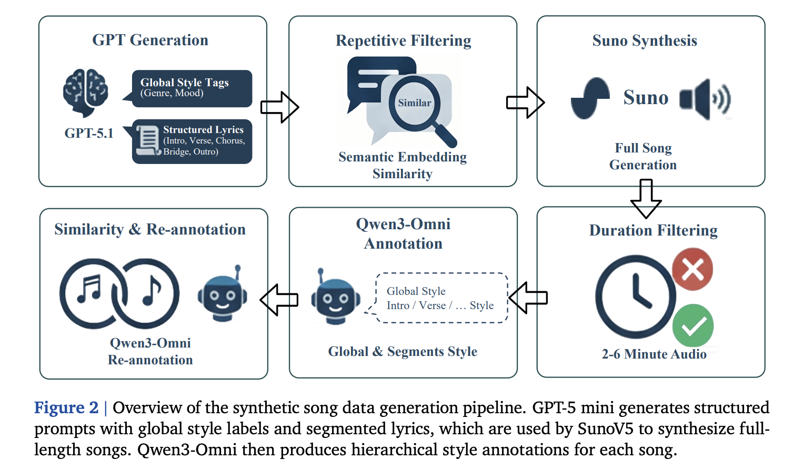
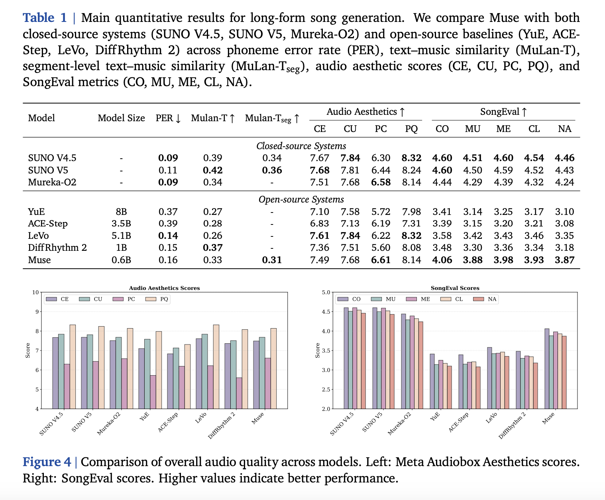
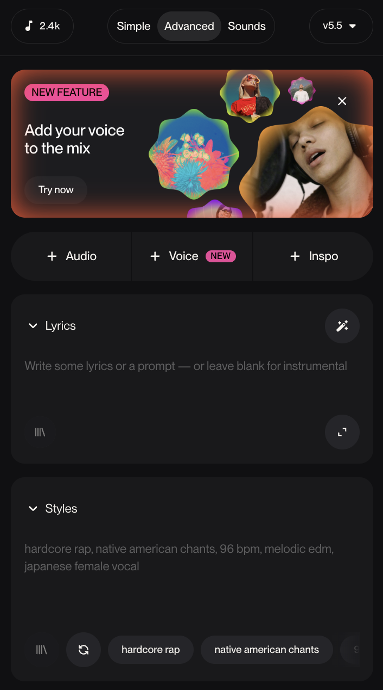
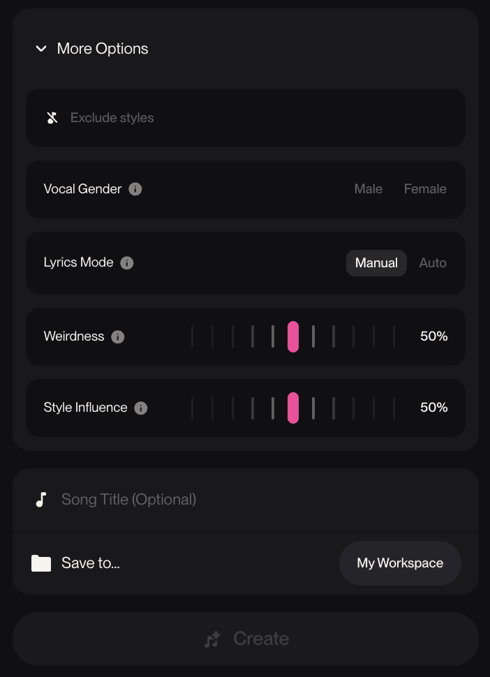
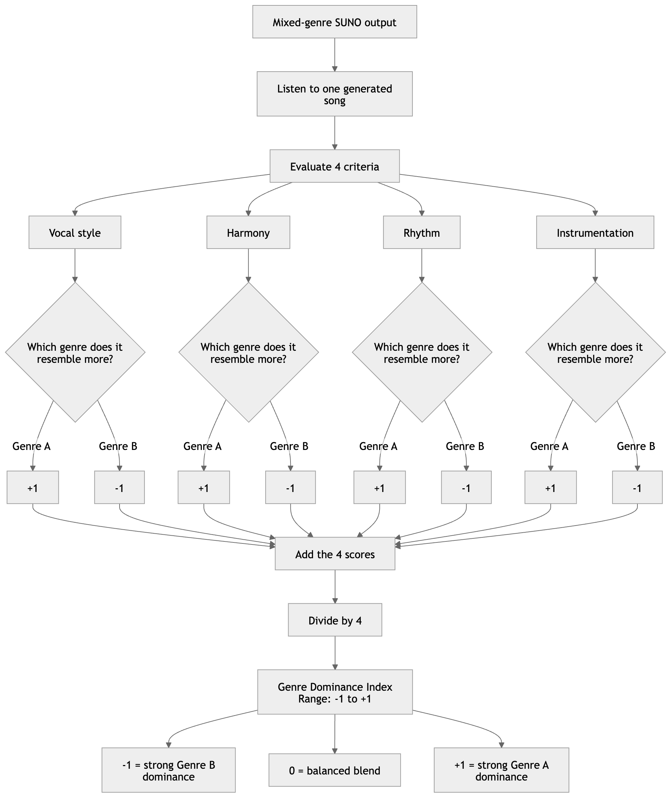
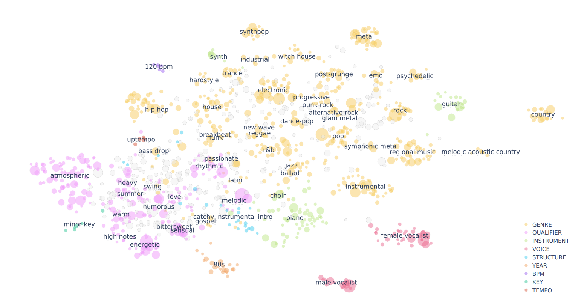

#### 🤔 *How Does SUNO Understand and Recombine Musical Genres?*

## Midterm Project

### What I did for my project?

Over the past few weeks, I have taken a deep dive into the powerful AI music tool Suno. I was particularly curious about how the platform interprets musical genres and how the model operates in order to generate music that feels authentic to the prompted style. My project ultimately developed into two separate branches:

1. `Research on Suno`: backengineering its mechanism based on other music-generating AI tools & published articles. 
2. `Experimenting with Suno`: using Suno Lab's Genre Wheel and the Create function to find patterns and potential biases.

***My original goal was to test SUNO’s understanding/stereotype of genre***

## Part 1: Suno's Behavior

Understanding Suno is a little harder than I think because there is no official public information on how it was trained and what data was being used. So I went to research online and came across many useful resources.

**Article: 2026.01.13 Fudan NLP Lab [Muse](https://arxiv.org/pdf/2601.03973)**

So, I came across this very inspiring article by Fudan NLP Lab. This article is mainly about building a reproducible academic alternative to systems like Suno for full-song generation. 

*"Suno shows that high-quality long-form song generation is possible, and we can partially study that capability by using Suno’s outputs to train and evaluate an open model called Muse."*

What they did was the following:

The authors used Suno to create a large synthetic dataset of full songs for training Muse. They want each song to come with: full song audio, lyrics, style description, and segment-level description.

1. GPT generates structured lyrics plus prompt tags
2. Suno generates the input prompt into full song audio
3. MuQ-MuLan computes similarity between the original text labels and the audio
4. Qwen3-Omni re-annotates the audio into new text descriptions based on what the Suno song actually sounds like.
5. They run the text–music similarity check again using the new Qwen-produced labels against the same Suno audio. 

They found out that Suno seems to respond to style prompts reasonably well, but not yet perfectly. They observed that some generated songs only partially conform to the provided global style labels. About 13% of generated songs had very weak text–music style alignment and the average similarity before re-annotation was 0.45. After re-annotation, similarity rose to 0.58, which suggests that the mismatch was often between the prompted labels and the actual audio Suno produced. They also claimed that the output audio is high-quality enough and that they didn't apply any other post-processing or loudness normalization to the audio files. 

#### Takeaways
- This article is showing us that segment-level style control matters. When they remove segment-style annotations, it also lowers Muse’s segment-level similarity score, which again argues that structure-aware prompting and supervision help the model track musical sections more faithfully. 
- For conclusion, Muse outperforms other open models, but still Suno remains competitive at translating style text into musically corresponding audio, both at the whole-song level and at the local segment level, at least as measured by MuQ-MuLan. That supports the idea that Suno has a stronger learned mapping from text descriptors like genre, mood, and vocal character to actual sonic outcomes.

## Part 1.5: Suno's Mechanism 

Since Suno is closed-source and has not publicly disclosed anything, I will make best guesses based on related Suno's open source TTS model Bark.
 
 Official Repository: [`Bark`](https://github.com/suno-ai/bark)

**1. User text is split into different control channels:**

By looking at Suno’s web interface, we can tell that user input is likely parsed into separate components: including lyrical or semantic content, style, genre, and vibe descriptors, and possibly structural cues such as [verse] and [chorus]. This suggests that Suno behaves more like a system with multiple conditioning streams.

**2. Text is converted into representations**

At this stage, Suno likely turns words like “Afrobeat,” “female vocal,” “warm analog synth,” “sad,” “80s,” and the lyrics themselves into embeddings or token sequences the generator can use. Since Suno has previously used transformer-based discrete-token audio generation in Bark, it is possible that Suno uses a related transformer-style token system here as well.

**3. Suno generates a high-level musical plan**

Suno likely will first create a high-level plan for the song before generating the final audio with details. Suno might first build some kind of broad overall representation, such as the lyrics theme, song structure, instrumentation and arrangement, vocal behavior, or other latent tokens that describe what should happen in the track.

On the other hand, it is worth noticing that Bark goes from text to semantic tokens, then to coarse codec tokens, then to fine codec tokens, and finally to waveform audio through a decoder. This does not prove that Suno’s music model works the same way, but they might be similar. This method also makes sense because first the system decides what the song should do (make a blueprint), then it determines how it should sound, and then it converts that plan into audio.

**4. Audio Generation!**

Turning into actual sound! Suno likely does this by first making a compact audio version (around 10-30 seconds of material) that the computer can handle easily, and then converting that into longer/final version of the song you hear.

## Part 2: Generate Songs + Experiment

### Genre Tags

I generated ten songs per genre for Afrobeat, City Pop, and New Jack Swing using the exact same prompt: “Generate a song in the style of ____.” I intentionally kept the prompt as broad and ambiguous as possible in order to give Suno maximum creative freedom and to observe how it independently interprets each genre.

My expectation was that Suno would produce ten distinct songs for each genre with some meaningful variation in its auto-generated text prompts. This would allow me to examine which tags Suno tends to associate with each genre and to identify broader stylistic patterns in its outputs. However, Suno ultimately began producing highly similar tags after only a few generations. To be honest, this outcome was somewhat disappointing, yet it was not entirely surprising. Much like my experience with ChatGPT, I have noticed that AI systems can sometimes become repetitive when pushed through the same kind of request multiple times, almost as if the model begins to exhaust a narrower range of likely responses.

I spent some time researching what might be causing this phenomenon and why such repetition emerges, and I will discuss my findings later in more detail. Since I had already generated a bunch collection of AI-produced songs, I decided it was still worthwhile to work with the material I had. Even if the outputs were less varied than I had hoped, they still offer useful evidence of how Suno appears to conceptualize these genres when given only minimal instruction. To visualize these patterns more clearly, I created a series of word cloud diagrams.

#### Afrobeat

#### City Pop

#### New Jack Swing

What I discovered while cleaning the text-tags is that Suno appears to possess a strong awareness of song form. In addition to generating instrumental descriptors and adjectives related to vibe and sonic texture, it frequently produced language that was explicitly structural. For example, some outputs included phrases such as:

- "pads wash in on the bridge for a brief floaty moment before the final high-energy chorus"
- "then drops to a minimal beat for the bridge before one last explosive hook". 

From my past experience using Suno, I had not paid much attention to song form. Instead, I tended to devote more effort to describing the lyrics, emotional atmosphere, and instrumentation, while more or less leaving the structural development to the AI’s own improvisation. It is fascinating to observe that Suno appears to account for formal organization automatically, even when the user has not explicitly considered or specified it in the original prompt.

More interestingly, this tendency toward output similarity seems to persist across other prompted genres as well. For instance, lyrics and song titles generated for the City Pop genre also resurfaced in some Afrobeat outputs. In some cases, the lyrics even appeared to reference one another, which was unexpected. I had anticipated more randomness and variation. At the same time, this may point less to a flaw in the model itself and more to the importance of more deliberate and thoughtfully constructed prompting. As a result, prompt design emerges as both a key area for future improvement and a promising direction for further research too.

### Bias Experiment

Another interactive part of the project with Suno was testing whether it tends to favor one genre over another when it is prompted to generate both at the same time. To explore this, I used Suno’s Genre Wheel, a large library of Suno-generated songs built around contradictory or unexpected genre combinations. I then developed a scoring system to measure each song’s genre bias across four criteria. 

1. Vocal Style / Language
2. Harmonic / Melodic Language
3. Rhythm / Groove
4. Instrumentation / Timbre

For each criteria, I scored whether it sounded closer to Genre A or Genre B, then averaged the four scores to get one final result. Because my dataset includes many different genre combinations, I use these scores to look for patterns across pairings and not to claim one simple overall bias.

<pre>

	├─────────────────────────┼──────────────────────────┤
	-1                	  	  0                	 		 1
   Genre B				   Balanced					 Genre A

</pre>

***Click to View Collected Data [`SUNO Data Bias Sheet.xlsx`](SUNO Data Bias Sheet.xlsx)***

#### My Discovery

I analyzed 58 songs that are in the genres of Cuban Afro, Ambient House, 2-step, Bedroom Pop, Afro House, Metal, Future Bass, Drill, New Jack Swing, Hip Hop, Hyper, Disco, Bossa Nova, Hyphy, Country, City Pop, Jazz, P-Funk, Samba, Dembow, Classical/Symphonic, Accordion Music, Gospel, Rumba, and Acid House. It might not be obvious at first, but Suno seems to favor genres with strong, immediately legible surface signifiers—especially beat-driven, production-defined, and playlist-tag-friendly styles—over genres whose identity depends more on ensemble practice, harmonic language, historical performance tradition, or subtler cultural context.

Unlike my prediction of Suno may be favoring a genre because it is Western or it is more popular and trending nowadays, the model actually favors genres that are:

- easier to render through obvious production cues
- more strongly represented in digital tagging culture
- more beat-forward and sonically stereotyped
- easier to reproduce a compressed version and has recognizable “vibe”

***My results suggest that SUNO’s bias is more about representation format and less about popularity or origin. It tends to preserve styles that are easy to reduce to a recognizable sonic package.***

### How Machine Learning is involved?

Although my project did not involve training my own model, machine learning is still central to every part of the tool I was studying. My project is an investigation into how a text-to-music generative model interprets prompts, represents genre, and turns those learned representations into audio.

Machine learning is involved in this project in several ways. First, Suno turns text prompts like “Afrobeat” or “City Pop” into a form the model can process, then uses what it learned from training data to generate music from those words. Second, it relies on pattern recognition, which means that it associates genres with features like rhythm, instrumentation, vocal style, and production texture. 

Machine learning also helps explain why repeated prompts produced similar songs. Similar prompts likely activate similar internal representations, so the model returns outputs from nearly the same region of its learned space. In addition, generative models sample from probabilities, so Suno may keep choosing the safest and most likely version of a genre instead of exploring more variety. Finally, the genre bias I observed also reflects machine learning: styles with clearer and more recognizable sonic markers may be easier for the model to learn and imitate. Overall, the project was still about studying how a trained machine learning system organizes and recreates music.

### What I learned

Earlier in the experiment, I noticed Suno output is getting more repetitive and less random. I went to learn more about what could be causing this phenomenon. 

- *Deterministic Sampling:*

I learned that generative models produce outputs by sampling from a probability distribution over possible next audio tokens. And if the sampling strategy is conservative, the model will repeatedly choose the highest-probability continuation.

- *Latent Representation:*

I learned that music models tend to encode genres as clusters in latent space. The model will likely samples near the “disco” cluster, which corresponds to a typical disco groove (e.g., four-on-the-floor kick, high strings). Because the latent space density is highest near prototypes, repeated generations gravitate toward the same region.

- *Prompt Limitations:*

Since musical prompts are usually converted into semantic embeddings. I realized that simple prompts with identical wording produce almost identical embedding vectors. Thus the generative process starts from nearly the same conditioning signal, which increases the probability of similar results.

### Reflection on this Project

This project taught me that studying an AI tool can be just as revealing as building one. At first, I thought I would mainly be testing whether Suno could generate convincing genre-based songs. However, as I continued researching and experimenting, the project became more about understanding the limitations, assumptions, and logic behind the generative model. Also, it was a great ear-training practice for me to observe the subtle differences in AI-made vs human-made music. 

If I had more time, I would spend much longer reading articles and researching existing technical work related to generative music systems. Because Suno is closed-source, one of the biggest challenges of this project was that I had to rely on indirect evidence, published research on related models, and observation of the outputs themselves. I would have liked to deepen that research further so that I could connect my experimental findings more carefully to broader machine learning concepts and to current academic work on music generation.

If I were to do this project again, I would also expand the dataset significantly. Ideally, I would want to analyze at least 200 songs instead of the smaller collection I used here. A larger dataset would make the conclusions more convincing and would reduce the chance that my observations were based too heavily on a limited sample. At the same time, this introduces a practical challenge, since Suno costs money💰:( Because of that, a future version of this project might combine my own generated data with pre-existing materials made by other users, as long as the prompts and context could still be documented carefully.

Another major improvement would be my experiment measurement method. My current scoring approach was useful as a first attempt, but it still depended heavily on my own musical judgment and perception. If I did this again, I would design a stronger metric with more parameters and involve more participants in the rating process. That would make the experiment less subjective and less dependent on my interpretation. 

Overall, this project changed the way I think about AI music tools. Before doing this work, I have not worked with Music Generation AI. After completing the project, I see Suno more critically as a system that is powerful, but also selective in what it can represent well. It can generate music that sounds convincing very quickly, but I/we have not yet discovered whether it understands genre in a deep or human way. In that sense, this project was valuable because it helped me think more carefully about what machine learning models are capable of doing, whether they are truly creative or not.

### Citations:
- [SUNO](https://suno.com/)
- [Word Art](https://wordart.com/create)
- [Bark](https://docs.coqui.ai/en/dev/models/bark.html?utm_source=chatgpt.com)
- [Muse: Towards Reproducible Long-Form Song Generation
with Fine-Grained Style Control](https://arxiv.org/pdf/2601.03973)
- [A Case Study with Suno and Udio
](https://arxiv.org/pdf/2509.11824)

