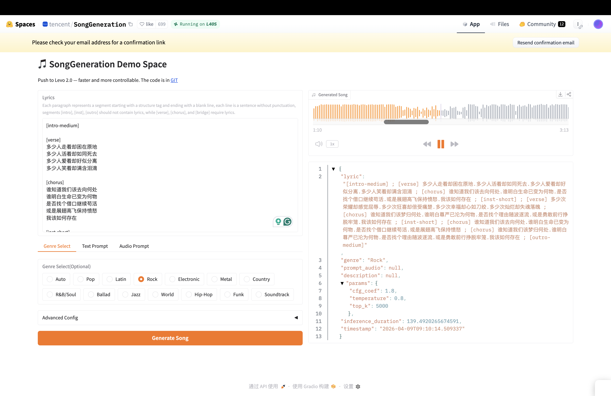
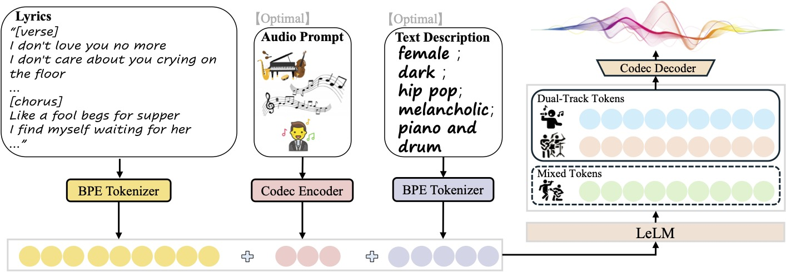

## Research 2
### LeVo: High-Quality Song Generation with Multi-Preference Alignment

### Project Audio Files
[Google Drive Link](https://drive.google.com/drive/folders/1vaKHVXugfW11fHfSiKSuoMQGVAHEh4Ru?usp=sharing)

#### Which Approach and Why?
I am both interested in text(lyrics)-audio approach that generates full songs and symbolic music generation approach where models are using ABC notation or numbers and letters to represent music notes. These two approaches reflect different goals in Music AI. Text-to-audio models prioritize speed and end-to-end song generation, while symbolic generation makes the compositional logic more visible and lets me see how the model understands melody, harmony, and structure. I initially explored NotaGen for symbolic generation, but due to persistent GPU limitations, I shifted to the SongGeneration text-to-audio model for this project.

###⚙️ Capabilities
SongGeneration is Tencent AI Lab’s open-source song generator built around their LeVo framework. It takes lyrics as the main input, and can also use an optional text description for genres/instrumentation, plus can add an optional reference audio clip. It allows users to adjust advanced configuration parameters which include the CFG Coefficient and Temperature. These features can change how the model reacts to the user prompt.

`CGF Coefficient` (Classifier-Free Guidance): this scale controls how strongly the model follows the user prompt. The higher the value, the more the output sticks to the given text input. The lower the value, the more freedom in synthesizing the output.

`Temperature`: this controls the randomness of the token selection. Higher temperature will select more diverse and unpredictable paths, while lower temperatures will lean towards the safer and more repetitive choices.

The lyric input has specific input requirements: 

- Must start with a structure tag and end with a blank line
- Each line must be a sentence without punctuation
- Segments tag [intro], [inst], [outro] should not contain lyrics, while [verse], [chorus], and [bridge] require lyrics.

###🎵 Composition Process

When first opening up their demo website, it came with a preloaded Chinese lyrics. My initial impression was pretty positive. The generated output featured an intimate piano introduction that convincingly evoked the stylistic conventions of a Chinese pop ballad. At the same time, however, I immediately noticed weaknesses in the lyric delivery: the phrasing felt unnatural, and the pronunciation of many consonants was noticeably awkward. Even so, the result was promising enough to sustain my curiosity, and I continued testing the model's capabilities with other inputs.

To evaluate the model’s understanding of C-pop genre (since it is developed by Tencent lab) conventions and Mandarin phrasing, I experimented with using other Chinese lyrics as the input. For this test, I used lyrics from a well-known Chinese rock song by Wang Feng. Although I selected “rock” as the genre, the model repeatedly generated something closer to a Shakira/Shawn Mendes/Ed Sheeran-style pop track. Most notably, the drum groove was fundamentally misaligned with the genre: it sounded overly choppy, light, pop-oriented, and sounded very impetuous but has no impact or weight. As a result, I deselected the genre selector and used my own text prompt that has more detailed stylistic descriptions. This adjustment produced somewhat better results, and the output moved closer to the sonic profile of a Chinese rock song. Even so, it still fell far short of my original expectation, particularly in its inability to approach Wang Feng’s strained, almost scream-like vocal tone. I attempted several generations with explicit vocal-tone descriptions, but the model consistently failed to respond to that level of nuance. One notable improvement, however, was in lyric phrasing. Early generations sounded as though the lyrics were being recited as a one-line-poetry, with nearly identical note lengths and little sense of natural pause or rhyme scheme. Later attempts showed some progress: the first verse began to exhibit more plausible pausing and word grouping, although the chorus still sounded mechanical, and still not like a sung performance.

Next, I tested the model using my own English lyrics written for a New Jack Swing-style song. I acknowledge that my lyrics may not reflect fully idiomatic English songwriting, and the rhythmic phrasing may differ somewhat from native-speaker conventions. Even with that limitation in mind, the model’s handling of phrasing remained problematic. The rhyme scheme I had written was clear, yet the model frequently failed to land lines on the designated rhymes. More importantly, it did not generate a convincing New Jack Swing groove. Instead, the rhythmic feel was generic, predictable, and aesthetically reminiscent of low-quality internet pop. Hoping to improve the result, I added an audio reference in the input stage. I fed the model with a track by my favorite Korean girl group NewJeans. Their song "Supernatural" captures a distinctive and compelling reinterpretation of New Jack Swing rhythmic language. After approximately 300 seconds of inference time, by far the longest generation I attempted, the model did not seem to understand the reference and just copied the exact same intro. Once the vocals entered, the output quickly collapsed back into the same cliche pop aesthetic. This was particularly interesting and revealing. It suggested that the model could imitate surface-level timbral or textural cues from a reference, at least briefly, but could not sustain a deeper structural understanding of genre. It also continued to misread vocal type and genre intent; despite I prompted female voice type in every trial, the generation ended up with a male vocal.

Finally, I compared the model directly with SUNO by taking the lyrics and prompt from a SUNO-generated Dominican Dembow song and feeding them into this model. In this case, the output was more successful than in my previous tests. The model appeared, at last, to establish at least a basic correlation between the prompt and the intended genre, and the result was somewhat closer to Dembow than its earlier attempts to mimic New Jack Swing. Nevertheless, the gap between this model and SUNO remained clear. SUNO demonstrates a far more developed understanding of genre, instrumentation, and stylistic detail. By contrast, this model appears far less responsive to narrower subgenres and performs best only when asked to generate highly stereotypical, broad genre templates. From an artistic perspective, its limitations are even more evident: it shows a weak grasp of harmonic progression, lyric phrasing, and complex drum groove design. In other words, it can occasionally reproduce the outer signs of a genre, but it struggles to internalize the musical logic that gives that genre expressive credibility.

###🤔 What Worked Well?

✅ 

* Detailed text prompt describing genre worked better than relying on the genre selector
* Chinese lyric phrasing improved after multiple generations.
* Audio reference helped the model imitate the intro texture briefly

❌

* Genre selector did not produce the intended genre
* Vocal tone descriptions were not followed consistently
* The model struggled with rhyme placement and lyric grouping
* Reference audio caused surface imitation but did not sustain the genre logic through the full song
* Vocal gender was unreliable

###💻 Underlying ML Technology

Behind the scenes, it is a Hybrid Large-Language-Model + Diffusion architecture. It separates musical planning from audio rendering. The LeLM component predicts song token sequences conditioned on lyrics and prompts, and a Music Codec reconstructs those tokens into audio.

To better represent the multi-layered nature of music, the model introduces a hierarchical language structure. It uses “mixed tokens” to encode high-level musical information such as melody and structure, and “dual-track tokens” to model vocals and accompaniment in parallel. This design reflects the fact that music is not purely sequential like text, but involves multiple simultaneous streams that must remain synchronized.

### New Concepts Learned

* `BPE`(Byte-Pair Encoding): learn the most common chunks of text and use them as building blocks
* `RTF`(Real-Time Factor): the ratio of processing time to audio duration, where RTF = 1 means real-time speed, <1 is faster than real-time, and >1 is slower.

###📝 Sources
* [Published Paper](https://arxiv.org/abs/2506.07520)
* ChatGPT for understanding vocabulary and unfamiliar concepts
* Hugging Face Space
* "Supernatural" - New Jeans (as audio input prompt)
* "存在" - 汪峰 Feng Wang (as lyrics input prompt)
* "Every Little Sign" - Olivia Gan (as lyrics input prompt)
* SUNO (text prompt & lyrics used for Dembow song generation)