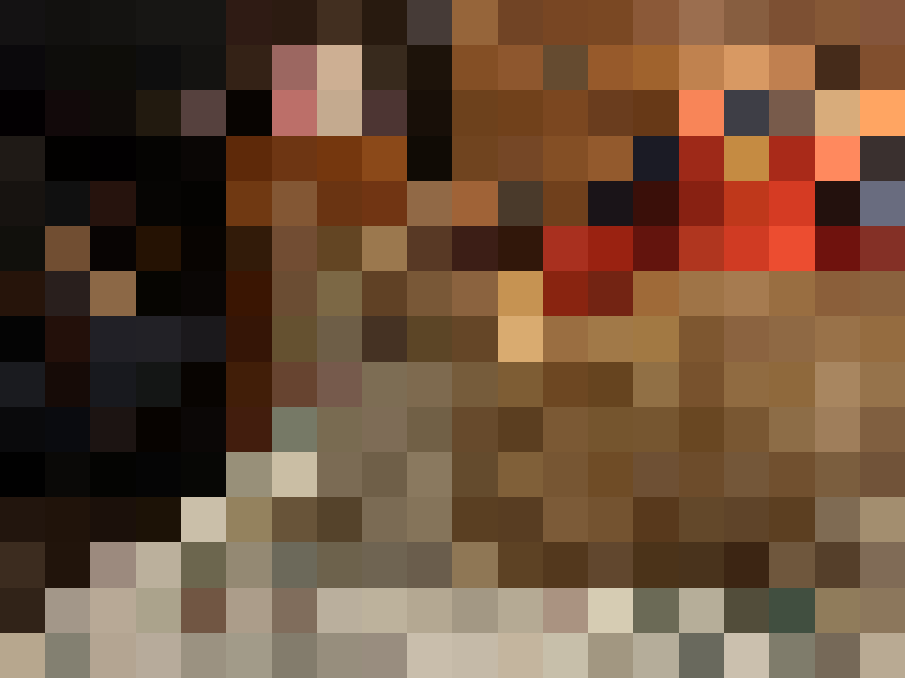

# Lab 5 Documentation
[Audio File Link](https://drive.google.com/file/d/1BGkSxdxm2VAG8nWdN3nT_91k6gzkorvO/view?usp=sharing)

## Developing the Algorithm 
### Inspiration
To develop my algorithm, I thought it would be interesting to have music based on input from the colors in an image. I thought this would be unique since every picture can have vastly different colors in different places of the image. This migth offer an interesting composition if I mapped the colors in an image to different pitches. I decided to use a photo of my cat, Fridge, for the image input since I felt there were a few different interesting colors that would make for a composition with lots of different pitches. Below is a picture of the original image of Fridge. 


### Processing the image - Making it Pixelated 
Obviously, there are too many different colors in the high resolution photo, so I needed to pixelate the image so that I could get a more reasonable number of colors in order to map to pitch. Since I wanted to do everything in Python I asked [Perplexity AI](https://www.perplexity.ai) how to analyze images in Python in order to also work with symusic. Perplexity informed me that I could "Load the image with Pillow or NumPy." After Looking into the [Pillow documentation](https://pypi.org/project/pillow/), I learned that Pillow can be used to process and analyze images. I added Pillow to my virtual environment using uv in Terminal and then pixelated the original image using Pillow. I asked Perplexity "how to pixelate an image with Pillow Python" and recieved the following code. 
```python
from PIL import Image

img = Image.open("input.jpg")
w, h = img.size

pixel_size = 16  # bigger = more pixelated
small = img.resize((w // pixel_size, h // pixel_size), resample=Image.Resampling.NEAREST)
pixelated = small.resize((w, h), resample=Image.Resampling.NEAREST)

pixelated.save("pixelated.jpg")
pixelated.show()

```
I changed the pixel_size to 200 after some experimentation in order to get the large pixels I wanted to achieve that had 20 big cells for the width and 15 for the height. This is the result below. 



### Processing the image - Analyzing the Pixelated Image 
Now that I got the pixelated image, I needed to use Pillow to analyze the 300 cells and get the color values from each cell. I wanted to make sure that Pillow wasn't going to use every single pixel in the image, as I wanted it to only analyze the colors based on the larger cells. After refering to Perplexity, I asked how to analyze the image based on the large 300 cells not the individual pixels and it provided me with the following code. It also explained that each cell is 15 by 20 pixels so I would essentially be cropping out each cell in order to individualize them to be analyzed by Pillow. The code made sense to me expect for the x0, y0, x1, and y1 lines. For clarification I learned about box formats from the article, [A Guide to Bounding Box Formats and How to Draw Them](https://www.learnml.io/posts/a-guide-to-bounding-box-formats/). This helped clarify for me that these are just the top left and botton right corner coordinates of the box which is the cell in this case. I've written comments in main.py to explain the lines of code. 

```python 
from PIL import Image
import csv
import os

img = Image.open("pixelated_photo.png").convert("RGB")
width, height = img.size

rows = 15
cols = 20
cell_width = width // cols
cell_height = height // rows

cells = []

for r in range(rows):
    for c in range(cols):
        x0 = c * cell_width
        y0 = r * cell_height
        x1 = width if c == cols - 1 else (c + 1) * cell_width
        y1 = height if r == rows - 1 else (r + 1) * cell_height

        cell = img.crop((x0, y0, x1, y1))
        colors = cell.getcolors(maxcolors=cell.size[0] * cell.size[1]) or []
        if colors:
            dominant = max(colors, key=lambda t: t[0])[1]
        else:
            dominant = cell.getpixel((cell.size[0] // 2, cell.size[1] // 2))

        rr, gg, bb = dominant
        hex_color = f"#{rr:02x}{gg:02x}{bb:02x}"

        cells.append({
            "row": r,
            "col": c,
            "x0": x0,
            "y0": y0,
            "x1": x1,
            "y1": y1,
            "r": rr,
            "g": gg,
            "b": bb,
            "hex": hex_color
        })

os.makedirs("output", exist_ok=True)

with open("output/grid_labels.csv", "w", newline="") as f:
    writer = csv.DictWriter(f, fieldnames=cells[0].keys())
    writer.writeheader()
    writer.writerows(cells)

print(f"Saved {len(cells)} cells to output/grid_labels.csv")
```
### My changes 
I made some changes to the code once that spreadsheet with the values were generated. I also didn't need all the extra information so I deleted the spreadsheet data that included the x and y values as well as the hex color. 

```python
rows = 15
cols = 20
cell_width = width // cols
cell_height = height // rows

cells = []

for r in range(rows):
    for c in range(cols):
        x0 = c * cell_width
        y0 = r * cell_height
        x1 = width if c == cols - 1 else (c + 1) * cell_width
        y1 = height if r == rows - 1 else (r + 1) * cell_height

        cell = img.crop((x0, y0, x1, y1))
        colors = cell.getcolors(maxcolors=cell.size[0] * cell.size[1]) or []
        if colors:
            dominant = max(colors, key=lambda t: t[0])[1]
        else:
            dominant = cell.getpixel((cell.size[0] // 2, cell.size[1] // 2))

        rr, gg, bb = dominant
        hex_color = f"#{rr:02x}{gg:02x}{bb:02x}"

        cells.append({
            "row": r,
            "col": c,
            "r": rr,
            "g": gg,
            "b": bb,
        })
```
### Color to Pitch
Now that the image is being analyzed, I needed to match the color to a particular pitch. For help I used the [symusic documentation](https://yikai-liao.github.io/symusic/) and learned that I could use MIDI note numbers very simply. I wasn't sure how to exactly write this out so I consulted the EPD tutor for guidance and learned that I need a dictionary for this with all the colors in my image. 

```python
note_map = {
    "red": 60,      # C4
    "orange": 62,    # D4
    "green": 64,     # E4
    "yellow": 66,   # F#4
    "black": 67,    # G4
    "brown": 69,      # A4
    "white": 71,      # B4
    "gray": 72,      # C5
    "blue": 78      # F#5

}

```

Another problem that I was worried about was that I wanted some similar colors with slightly different rgb values to still be binned as the same color. So for example there might be a pink and a dark red but I wanted them to both be in the red category so I asked Perplexity how to formulate code that could accomodate this and recieved the following code. With help from the EPD tutor, I learned that we need to use the Euclidean distance formula because it is the distance between two points in space which is essentially the two cells colors that I was deciding were similar or not. I used palette as another dictionary and got the specific rgb values from specific cells in the pixelated image for reference by using the Digital Color Meter application. 

```python 
	#categorize the cells by matching them to my reference colors as shown in the palette dictionary 
def color_distance(c1, c2):
    return ((c1[0] - c2[0])**2 + (c1[1] - c2[1])**2 + (c1[2] - c2[2])**2)**0.5

def get_color_name(cell_r, cell_g, cell_b):
    cell = (cell_r, cell_g, cell_b)
    # Make a dictionary using the colors in my image for the reference colors
    palette = {
        "red": (169, 42, 25),
        "orange": (255, 165, 98),
        "green": (65, 79, 64),
        "yellow": (198, 147, 82),
        "black": (16, 11, 5),
        "brown": (96, 65, 37), 
        "white": (202, 191, 169),
        "gray": (70, 59, 55),
        "blue": (105, 108, 127)
    }
    closest = min(palette, key=lambda name: color_distance(cell, palette[name]))
    return closest
```

## Using Symusic to Convert Score to Audio
In order to actually have an audio and MIDI output I used the example code provided on the class website. I had first tested this out and so I thought it was simple enough to borrow a lot of the example code. The example code already had randomized velocity and duration, so I kept those the same from the example, but I had to change the scale degrees line of code since I was using the pitches from the color analysis of the image. I wasn't exactly sure how to format the lines of code to refer back to the lines of code that had to do with the cell color identification so I referred to Perplexity and recieved the code below.  

```
for cell in cells:
    r, g, b = int(cell["r"]), int(cell["g"]), int(cell["b"])
    color_name = get_color_name(r, g, b)
    pitch = note_map[color_name]  # IMAGE COLOR → PITCH
```

## The Output
Just like the example code, symusic was able to output a MIDI file and audio file. In terms of editing the output, I decided to leave the output because I felt that it was a reasonable length (the durations weren't too long or too short), and it was nice that there was a fair bit of repetition since certain colors repeated a few times in a row. There wasn't too much repetition though, as there were enough colors for pitch variability and the random velocity and duration helped make the audio output sound unpredictable yet not unreasonable, which I feel is similar to other algorithmically generated pieces we've heard in class. I also thought that it didn't make sense to edit the pitches into a more "pleasant" melody because that would completely defeat the purpose of the uniqueness of the order of colors from the photo I chose. If I wanted a different melody, I could have just used a photo with a different color composition/order.

