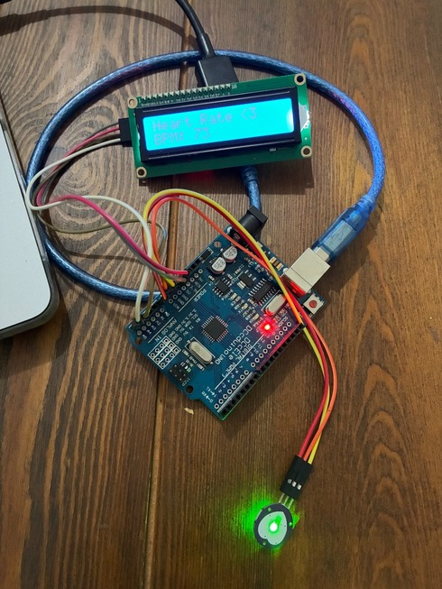
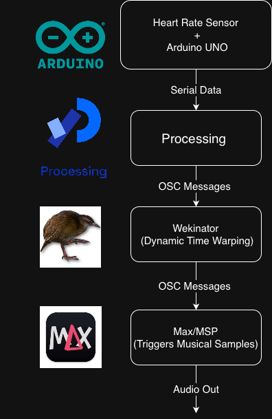

# Midterm Proposal 

____

## 1. What will I do?
I will have a heart rate sensor detect the user's heart rate and have it trigger different musical samples in Max/MSP, depending on if the heart rate is slow, normal, or fast. 

## 2. How will I do it?
I will do this by utilizing a heart rate sensor, Arduino UNO, Processing, Wekinator, and Max/MSP.

### How will I use machine learning?
I will use machine learning by utilizing Wekinator, a software application developed by Dr. Rebecca Fiebrink that uses machine learning in order to construct interactive systems without needing to write code. It can act as a bridge between input devices and output devices using OSC, OpenSoundControl, messages. In this case I'll be using  Wekinator as a bridge between the heart rate sensor data coming from the Arduino and Max/MSP, which will be triggering musical samples. 

### Dynamic Time Warping 
The purpose of using Wekinator is for its dynamic time warping capabilities. Dynamic time warping is an algorithm for time series alignment. This means that it aligns two sequences by warping the time until the sequences are basically matched up. Even if a sequence is time shifted a bit, dynamic time warping looks for similarities in the sequences. It was originally used for speech recognition, but I'll be using it for heart rate data, and for recognizing the different heart rate conditions which is slow, normal, and fast based on the IBI, Inter-Beat Interval. IBI is the time in milliseconds between consecutive heart beats detected by the light sensor. Each heart rate condition will have the training example of IBI sequences so when a new IBI sequence comes in, dynamic time warping should be able to compare it to the trained sequences and match it to the correct heart rate condition, even if it isn't exactly the same. 

### Heart Rate Sensor + Arduino UNO
I will acomplish this by starting with a simple optical pulse sensor which measures heart rate via light absorption. This is connected to an Arduino UNO which outputs serial data of the Inter-Beat Interval.  I decided to output IBI instead of the beats per minute because IBI shows smaller changes that would be more suitable for dynamic time warping, as opposed to beats per minute, which is a more smoothed out metric. Since beats per minute is more human readable, I decided to show it on the LCD screen connected to the Arduino, but still have the IBI as serial output. 

### Sending Serial to Processing 
Wekinator cannot directly take serial data and needs to communicate by OSC messages. The issue is that the Arduino UNO outputs serial data, not OSC messages. To overcome this challenge, an Arduino with an Ethernet shield or Wi-Fi module can be used, since OSC is a network-based protocol. Since, I do not have these though, I opted for converting serial data to OSC using the software, Processing. I can use the library oscP5 and it will be able to package my IBI serial data into OSC that will then send to Wekinator. 

### Processing to Wekinator 
Now that my IBI data is converted to OSC messages that can used as input for Wekinator, dynamic time warping can be used to classify the IBI patterns into the three groups (slow, normal, fast). Wekinator can then output OSC of these three different groups to Max/MSP. 

### Wekinator to Max/MSP
Wekinator will send OSC messages to Max/MSP and then trigger the corresponding samples depending on whether the heart rate OSC message is for the slow, normal, or fast heart rate condition groups via [sfplay~]. I can have the slow condition trigger a slow melancholy chord progression, the normal condition can trigger a different progression at a medium tempo, and the fast heart rate can trigger a distorted and fast progression. 

### Diagram 

## 3. Questions, Concerns, and Stretch Goals
I'm not exactly sure how Wekinator is doing dynamic time warping in terms of its code, I'd like to do some more research about this so I can have a better understanding of what is occuring under the hood. How is it aligning the sequences? How is the sensitivity adjusted so that patterns within the sequences it is comparing are confirmed as being part of that group/similar to that sequence, even when the timing isn't exactly the same between the sequences? I know Wekinator can do dynamic time warping with speech based on some of the tutorial videos, and I believe it should be able to do it with heart rate data too since it is the same concept, but I'd need to test this first. I'm also concerned about the musicality of having Max trigger different samples per group (slow, normal, and fast). I might need to experiment with the sample lengths or perhaps other audio objects in order to make sure that no matter what the heart rate is, the output is still musically sensible and engaging for the audience. Some stretch goals that I have, if this works, is to build upoon it to make it more interactive and biofeedback centered by implementing other sensors and parameters. For example, I might add on breathing rate by having the user wear a microphone to detect the speed of breaths. This could then be mapped to a musical parameter such as filter cutoff. 
