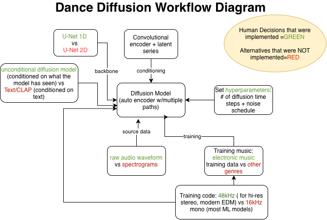

# Part 1: Song Selection 
### Song Title
Synthetic Love 

### Artist 
DJ Swami 

### Year 
2023 

### Summary 
"Synthetic Love" aims to uncover the nature and complexitites of love in the digital age. It is a stylistically mainstream-esque electro-trap pop song that features a classic yet enticing dubstep/trap beat with unintelligible repetitive melodic vocal lines that sit atop the beat. The vocal samples are manipulated and seemingly wrapped, contributing to a unique texture and interesting melodies that adds character and variety to the overall composition. The use of a low rumbly synth bass and synth instruments is acompannied by more humanistic, organic elements such as "evocative Indian vocal chants" and live playing on certain elements of the song such as the drums, guitar, piano, and some male vocals performed by the artist himself. On a technical front, the artist utlizes Ableton Live 11 and the Dance Diffusion platform. 

# Part 2: Technical Analysis 
### ML Architecture 
[Dance Diffusion](https://wandb.ai/wandb_gen/audio/reports/Harmonai-s-Dance-Diffusion-Open-Source-AI-Audio-Generation-Tool-For-Music-Producers--VmlldzoyNjkwOTM1) is a collection of machine learning models that are open source generative audio models developed by Harmonai. Harmonai is a part of Stability AI which notably created a text-to-image generative AI model called Stable Diffusion. Dance Diffusion is like Stable Diffusion but it works with audio. As stated by [“A Gentle Introduction to Dance Diffusion”](https://wandb.ai/wandb_gen/audio/reports/A-Gentle-Introduction-to-Dance-Diffusion--VmlldzoyNjg1Mzky), it is a diffusion model which means that it creates new data by destroying and recovering the data which was used to train it by adding and removing noise. The process of destroying the data is “forward diffusion” or “noising”, and the process of recovering the data is “reverse diffusion” or “de-noising”. Since Dance Diffusion generates audio, the Dance Diffusion models are each trained with a different selection of audio files. This is important because the diffusion model learns how to recover based on the audio it is trained on, so it will generate novel audio based on whichever dataset of audio files it was given, whether that be piano timbre(the MAESTRO dataset) or goose sounds (trained via xeno-canto). 
I had some trouble finding sources that directly discussed Dance Diffusion’s architecture but there was some discussion on [Hugging Face](https://discuss.huggingface.co/t/a-couple-of-super-basic-questions/25551) regarding “a 1D U-Net that was added to support audio data in Dance Diffusion, and that will be used for other 1D tasks”. This led to the discovery of a research paper, [Schneider et al.](https://www.researchgate.net/figure/D-U-Net-architecture-used-both-for-the-diffusion-decoder-and-latent-diffusion-generator_fig1_367529681) discussing 1D U-Net that stated, “U-Nets with 1D convolutional kernels are more efficient compared to 2D in terms of speed.” [Emergent Mind](https://www.emergentmind.com/topics/1d-unet) further contributes that 1D U-Net is "neural network architecture" and having the 1D convolution layers, as opposed to 2D convolution layers, helps to reduce the model size and requires less computational demands. Using other research papers that discussed diffusion models and U-Net architecture was also useful in understanding how Dance Diffusion was more than likely developed.  Another research paper by [Chang et al.](https://arxiv.org/pdf/2306.04542) describes this architecture by explaining that it is a “U-shaped encoder-decoder architecture”. Essentially, the encoder is extracting “high-level features from data” and then applies convolution layers to learn the patterns in the data, according to [Geeks For Geeks](https://www.geeksforgeeks.org/machine-learning/u-net-architecture-explained/). Then, as described by the [Chang et al. paper](https://arxiv.org/pdf/2306.04542), the decoder takes these features and uses them “for different purposes and usually upsamples back to the original dimensionality of the data”. This means that the audio can be thought of as reconstructed with the convolution layer applied. More specifically, the U-Net also has something called skip connections for precision. Skip connections, according to [Geeks For Geeks](https://www.geeksforgeeks.org/machine-learning/u-net-architecture-explained/), help maintain the spatial accuracy of the data, in this case audio, "by bringing forward detailed features from earlier layers". This U-Net achritecture is used for image segmentation and also audio segmentation for a diffusion model like Dance Diffusion. [The Dance Diffusion page on Hugging Face](https://huggingface.co/docs/diffusers/v0.32.2/api/pipelines/dance_diffusion) was incredibly helpful with defining the parameters. These include: batch size, num inference steps, audio length in s, generator, and return dict. The batch size parameter indicates the number of audio samples to generate, num inference steps is the number of denoising steps, generator is a PyTorch generator to make generation reproducible, audio length in s is length of generated audio is seconds, and return dict is whether or not to return an audio pipeline output or a [tuple](https://www.webopedia.com/definitions/tuple/), which is essentially just a sequence of elements. 
These models were most likely chosen because they were created with producers and musicians in mind according to [Harmonai](https://www.harmonai.org), and are not difficult to use as outlined on [Google Colab for Dance_Diffusion.ipynb](https://colab.research.google.com/github/harmonai-org/sample-generator/blob/main/Dance_Diffusion.ipynb). Specifically, according to the [HAISP Dataset](https://docs.google.com/spreadsheets/d/1ZzV0MdhRn0Apb0k03j52OlbP8nxwo2t4IRmOd8nSa-o/edit?gid=227254321#gid=227254321), DJ Swami wanted to have the models tune a wide collection of samples to the same key and use 80% of his own material as training data. Additionally, he used three outputs from his own sample library to craft unique synths, female vocal samples mixed with Indian vocal chants, and synth basslines. In terms of input/output formats, the inputs are the training audio and the output are the generated audio clips. According to [AudioCipher’s](https://www.audiocipher.com/post/dance-diffusion-harmonai#:~:text=The%20file_path%20field%20is%20where,for%20the%20green%20check%20again) instructions for using Dance Diffusion, it seems that it works best with WAV files for input and output formats. 
The [training pipeline](https://arxiv.org/pdf/2306.04542) for AI models is more about learning the data given to the model as training data to get model checkpoints. For the inference pipeline, this is less computationally straining because the trained model engages in de-noising. This results in new audio generated. 
### Tool Ecosystem
Dance Diffusion requires Python 3.7+ and utilizes software such as PyTorch which is necessary for the diffusion U-Net model as indicated in an [interview with Harmonai](https://wandb.ai/wandb_gen/audio/reports/Interview-Harmonai-Dance-Diffusion-and-The-Audio-Generation-Revolution--VmlldzoyNjg1ODgw). In terms of hardware, the training of the model is more demanding. Though not explicitly stated, it can be assumed that in order to run Dance Diffusion locally the hardware requirements would be on par with the [hardware required for Stable Diffusion](https://rentamac.io/run-stable-diffusion-locally/#:~:text=CPU%20–%20A%20modern%20multi%2Dcore,log%20in%20and%20start%20creating), in which there is more data available and public. Thus, it would be ideal to have 24GB VRAM, minimum 8 GB RAM but more suitably 16-32 GB or more, macOS, Windows/Linus operating system, and preferably a discrete GPU. The primary releases are the notebook versions. The primary Dance_Diffusion.ipynb (Google Colab/GitHub) hit v0.12. Dance Diffusion integrates well with standard ML ecosystem tools such as PyTorch + torchaudio and Hugging Face Diffusers. The custom code from Harmonai includes the 1D U-Net for audio waveforms, novel samplers, and dataset-specific training made specifically for raw audio generation, but the off-the-shelf code, according to [Medium](https://medium.com/@lambdafluxofficial/part-2-understanding-the-diffusers-library-a-practical-breakdown-of-key-components-d1dff474b088) is more for inference (like with PyTorch) as opposed to training. For example, [Hugging Face Diffusers](https://huggingface.co/docs/diffusers/v0.13.0/index) provides ready pipelines and downloadable pre-trained checkpoints. 
### Data Pipeline
For some of the gaps regarding the data pipeline of Dance Diffusion, I used some information regarding other models that function similarly such as [Tiny Audio Diffusion](https://towardsdatascience.com/tiny-audio-diffusion-ddc19e90af9b/#:~:text=This%20is%20a%20key%20piece,the%20information%20while%20being%20trained), diffusion models in general, and the architecture and way in which Dance Diffusion functions based on its [Harmonai GitHub page](https://github.com/Harmonai-org/sample-generator/blob/main/Dance_Diffusion.ipynb). This led to the conclusion that Dance Diffusion most likely requires mono or stereo audio files such as WAV, or any PyTorch loadable audio for source data at specific sampling rates such as 44.1kHz, 48kHz, or higher. According to [Milvus: How Do You Implement Data Preprocessing For Diffusion Models](https://milvus.io/ai-quick-reference/how-do-you-implement-data-preprocessing-for-diffusion-models), the audio clips are normalized for preprocessing and cut so that they are each the same length for the purpose of tensor conversion. [Tensor conversion](https://docs.pytorch.org/tutorials/beginner/basics/tensorqs_tutorial.html) is the way in which the raw audio files are turned into numerical representations so that the model can learn and generate new audio. There are minimal [manual feature engineering decisions](https://huggingface.co/docs/diffusers/en/api/pipelines/dance_diffusion), as it relies on the U-Net learning time-domain patterns. If anything, the choices for feature engineering decisions include length and sample rate and the normalization scheme. This model is designed for [offline processing](https://www.archivinci.com/blogs/diffusion-models-guide#:~:text=High%20Computational%20Cost%20and%20Slow,tasks%20that%20require%20rapid%20output) as most diffusion models are. 
### Workflow & Process
As stated by Zach Evans in an [interview](https://wandb.ai/wandb_gen/audio/reports/Interview-Harmonai-Dance-Diffusion-and-The-Audio-Generation-Revolution--VmlldzoyNjg1ODgw#:~:text='no%2C%20no%2C%20that's%20the,1D%20in%20the%20right%20places.), the creator of Dance Diffusion, The development of the Dance Diffusion models was inspired by Sony CSL and many other music classifiers and tools that could be compatible with unconditional audio diffusion models. The developers were also heavily inspired by Disco Diffusion. This led the developers to build their models by expanding on diffusion models that existed for image generation, such as Stability AI, but applying those diffusion techniques to audio as described in an interview with [Harmonai](https://www.youtube.com/watch?v=KmB8z2CYjZY&t=217s). This led to using diffusion in the time-domain for audio and then experiment by [training their initial models](https://wandb.ai/wandb_gen/audio/reports/Harmonai-s-Dance-Diffusion-Open-Source-AI-Audio-Generation-Tool-For-Music-Producers--VmlldzoyNjkwOTM1#:~:text=Their%20first%20model%2C%20Dance%20Diffusion,be%20used%20by%20music%20producers.) using datasets and setting [hyperparameters](https://www.geeksforgeeks.org/machine-learning/hyperparameter-tuning/), which are the parameters that are set before the training begins and control the way in which the model learns. The most critical hyperparameters when training a diffusion model, according to [Milvus: What Hyperparameters Are Critical When Training A Diffusion Model](https://milvus.io/ai-quick-reference/what-hyperparameters-are-critical-when-training-a-diffusion-model), are factors such as the number of diffusion timesteps and the noise schedule. Refinement occurred by community Colab notebooks. Some key decision points were made such as whether to use raw audio waveforms versus spectrograms, and ultimately raw audio waveforms were chosen. There was also a decision made regarding the conditioning of the model and the developers settled on using [unconditional audio generation model](https://www.emergentmind.com/topics/unconditional-diffusion-models) just like the common [unconditional image generation diffusion models](https://medium.com/@myschang/diffusion-models-unconditional-conditional-image-generation-e7ced52b09b5), instead of [Text/CLAP, Contrastive Language-Audio Pretraining](https://arxiv.org/html/2506.11350v1). This makes sense because Dance Diffusion is not text to audio, it is generating audio from audio so it cannot be using Text/CLAP. 
Humans intervened by doing the manual refining of the audio used for training to avoid poor quality audio to be used and they decided on the training material. According to the [interview](https://wandb.ai/wandb_gen/audio/reports/Interview-Harmonai-Dance-Diffusion-and-The-Audio-Generation-Revolution--VmlldzoyNjg1ODgw#:~:text='no%2C%20no%2C%20that's%20the,1D%20in%20the%20right%20places.), a lot of electronic music was used “because it tends to be full spectrum, high resolution, stereo, extra stuff going on at the high end and the low, really good to test on”. From the same interview, it was also discussed how the developers created a “convolutional encoder and get a latent series and then use that as conditioning for a diffusion model” which resulted in an effective auto encoder with multiple paths since it is diffusion based and “keeps refining itself”. This provides great results and having models that “have an iterative auto encoder” provides unique artifacts that trumps using down sampling artifacts or the “horrible hum of some auto encoders”. 
Additionally, they most likely needed to decide and [fine tune the number of diffusion](​​https://milvus.io/ai-quick-reference/how-do-you-choose-the-number-of-diffusion-steps) steps by first listening to generated audio demos in order to pick the best step number with the best sound. 
### Workflow Diagram 

# Part 3: Musical Analysis
### Structure 
The song begins with the intro consisting of a simple repetitive synth pattern that develops as bass and drums are added, building anticipation. This lasts for approximately the first 30 seconds of the song before the pre-chorus comes in. This features interesting textures of male and female vocals that sound unintelligible. Then at 55 seconds, the chorus occurs marked by the vocal melody that is no longer unintelligible, repeating “Synthetic Love”. These vocals are coupled by a synth melody and piano and this is when the groove is fully established with all of the song’s components. The chorus lasts until about 1:24 in which there is a sort of synth interlude with more sparse vocals. This can be thought of as a bridge that is then followed by the chorus again at 2:04. This continues until 3:00 in which the verse is introduced by female vocals and the piano that’s notably calmer than the chorus and ultimately leads us to the outro at 3:30 in which there is an unintelligible part and fade for the ending at 3:48. 
The organization of this song is not notably different compared to many EDM songs of this style, especially having the drums drive a lot of transitions between sections. In terms of melodic phrasing, it is quite unique and interesting how the phrasing of the vocals is done. Though a lot of the speech is unintelligible, the vocals make sense melodically and a clear melodic line can be followed, even if the exact words being sung are more difficult to follow. Even in the outro, for example, the talking part’s intonation is aligned with the background synth and drums and makes musical sense. This structure makes sense given the Dance Diffusion generation method because Dance Diffusion regenerates and manipulates audio samples which is a major aspect of electronic music and thus allows the artist to make a lot of creative decisions regarding how those samples are placed. In other words, this helps make the structure of the song feel natural and like an organically produced song because in many ways, it is by allowing the artist to have more control over the structure since Dance Diffusion is just helping with producing the samples. Though these samples of course shape the melody, it does not radically influence the overall structure of the song. If anything, DJ Swami states in the [HAISP dataset](https://docs.google.com/spreadsheets/d/1ZzV0MdhRn0Apb0k03j52OlbP8nxwo2t4IRmOd8nSa-o/edit?gid=227254321#gid=227254321) that AI suggestions had influenced “structural adjustments” but did not have much of an influence on the structure. 
### Musical Elements
According to the [HAISP dataset](https://docs.google.com/spreadsheets/d/1ZzV0MdhRn0Apb0k03j52OlbP8nxwo2t4IRmOd8nSa-o/edit?gid=227254321#gid=227254321), when it came to the harmony of the song, AI was used in creating harmonies that served as initial inspiration and helped to streamline the creative process. However, this also introduced some creative issues because of the need to fine-tune the AI’s harmony so that it still aligned with the personal “emotional and stylistic intentions” of the song. The drums and rhythmic patterns were not generated by AI. Instead, these were live performed; however, the melodic contours and pitch selection did get some assistance from AI. Much like the harmony, melodic ideas generated by Dance Diffusion were used as inspiration and a starting point when composing the song. In terms of timbral characteristics there was some AI influence since 20% of the training data was from public “diverse music samples”  and there was also some usage of AI for the vocal synthesis. For example, DJ Swami utilized his own sample library to train Dance Diffusion to create unique female vocal samples that were combined with Indian vocal chants. The same was done to create unqiue synths and synth basslines, indicating timbral influences. 
### AI Signatures 
In terms of elements that reveal AI involvement, the most obvious would be the female vocals that don’t exactly sound human and perhaps a bit more computerized in contrast to the male voice at only certain instances. There really isn’t much of a fearful “uncanny valley effect” since the female vocal still sounds like it could also just be a human voice with a lot of processing. Some strengths that are unique to the AI approach as described by DJ Swami is that having AI generate some melodic and harmonic inspiration can really be efficient in terms of time spent and can offer interesting suggestions and ideas for composition. I also feel that some unique timbres can be generated by this sampling approach as opposed to using AI to generate an entire song from start to finish. In terms of limitations, there are definitely some challenges in terms of making sure that the generated samples can fit with the style of the song and if those generated components align with the core theme/style. This is not an issue with traditional production since the artist can tailor and perform every sample exactly as they see fit for the song’s style, without needing to worry as much about how to ensure that all live and generated samples fit together. 
# Part 4: Music Critic
### Comparative Analysis
A decent amount of the AI Song Contest entries utilized Magenta and ChatGPT. DJ Swami’s song, Synthetic Love, is different from the entires that utilize these other AI tools because DJ Swami’s use of Dance Diffusion is more focused on generating samples to be used, as opposed to the larger structure of the piece, which is more aligned with the functions of Magenta. In addition, DJ Swami did not use an AI to generate all of the lyrics, as a lot of entries did. Synthetic Love is also a very popular music type song that is not as distorted and experimental like some other entires were. In terms of trade-offs between automation and control, automation can really benefit and streamline the creative process by offering a starting point; however, it can also make control over the artist product a bit more difficult as a result. For example [DJ Swami recalls in the dataset](https://docs.google.com/spreadsheets/d/1ZzV0MdhRn0Apb0k03j52OlbP8nxwo2t4IRmOd8nSa-o/edit?gid=227254321#gid=227254321) that, though a melody might be generated and sounds good, it might not fit the music stylistically or fit the emotional vibe of the song. When it comes to reproducibility, Synthetic Love would be quite difficult to recreate because it integrates a lot of human performance and the artist’s own unique sample library that contributes a sort of unique fingerprint. It is absolutely a scalable song to be streamed digitally and scalable in its musical style that combines trap and EDM.  
### Ethics and Aesthetics
The artist used his own live performances and his own sample library for a large majority of the training data. The 20% he used that wasn’t his own, was publicly available samples from diverse musical styles so there shouldn’t be any concern regarding copyright infringement. The artist clearly contributed his own creative style and musical prowess to the song, and it is clear that he has ownership over the song given a large majority of the training data being his own or publicly available samples. Despite the wonders and ingenuity of AI, dance diffusion is no different from many other AI tools and other diffusion models in that it is very detrimental to the environment due to the incredibly high amount of computational power required. According to the [United Nations](https://www.unep.org/news-and-stories/story/ai-has-environmental-problem-heres-what-world-can-do-about), the training of these models is very costly in terms of energy especially with there being so many parameters implemented. This results in the need to burn more fossil fuels which contributes to air pollution in the form of carbon emissions.  Data centers required to run these AI tools also consume vast amounts of water “to cool electrical components”. The electronic waste produced by these data centers are another major issue, as they often contain “hazardous substances, like mercury and lead”. 
### Innovation Assessment
I feel that DJ Swami’s approach to this song was truly unique because of his control over the structure of the song through editing in Ableton and his mix of his own sample library paired with some AI components to provide extra character and innovation. This is pretty novel when compared with other songs that had more of the structure influenced by AI (Magenta) for the competition. I thought his technique of combining female vocals with Indian chants was especially novel since this cross cultural timbre is very unique and isn’t typically integrated in such a popular music context. This integration of cultural music contributes to the field of music production and blending styles whilst also contributing a personal, authentic way to use AI in one’s own music. In terms of workarounds for limitations, a lot of fine-tuning had to be done to ensure that all the generated samples aligned musically with the live performed samples and aligned with the emotions of the song. This could mean editing within the DAW to fix issues or generating other samples. 

# References Section
- [Dance Diffusion](https://wandb.ai/wandb_gen/audio/reports/Harmonai-s-Dance-Diffusion-Open-Source-AI-Audio-Generation-Tool-For-Music-Producers--VmlldzoyNjkwOTM1)
- [A Gentle Introduction to Dance Diffusion](https://wandb.ai/wandb_gen/audio/reports/A-Gentle-Introduction-to-Dance-Diffusion--VmlldzoyNjg1Mzky)
- [Hugging Face](https://discuss.huggingface.co/t/a-couple-of-super-basic-questions/25551)
- [Schneider et al.](https://www.researchgate.net/figure/D-U-Net-architecture-used-both-for-the-diffusion-decoder-and-latent-diffusion-generator_fig1_367529681) 
- [Emergent Mind](https://www.emergentmind.com/topics/1d-unet)
- [Chang et al.](https://arxiv.org/pdf/2306.04542)
- [Geeks For Geeks](https://www.geeksforgeeks.org/machine-learning/u-net-architecture-explained/)
- [The Dance Diffusion page on Hugging Face](https://huggingface.co/docs/diffusers/v0.32.2/api/pipelines/dance_diffusion)
- [tuple](https://www.webopedia.com/definitions/tuple/)
- [Harmonai](https://www.harmonai.org)
- [Google Colab for Dance_Diffusion.ipynb](https://colab.research.google.com/github/harmonai-org/sample-generator/blob/main/Dance_Diffusion.ipynb)
- [HAISP Dataset](https://docs.google.com/spreadsheets/d/1ZzV0MdhRn0Apb0k03j52OlbP8nxwo2t4IRmOd8nSa-o/edit?gid=227254321#gid=227254321)
- [AudioCipher’s](https://www.audiocipher.com/post/dance-diffusion-harmonai#:~:text=The%20file_path%20field%20is%20where,for%20the%20green%20check%20again)
- [interview with Harmonai](https://wandb.ai/wandb_gen/audio/reports/Interview-Harmonai-Dance-Diffusion-and-The-Audio-Generation-Revolution--VmlldzoyNjg1ODgw)
- [hardware required for Stable Diffusion](https://rentamac.io/run-stable-diffusion-locally/#:~:text=CPU%20–%20A%20modern%20multi%2Dcore,log%20in%20and%20start%20creating)
- [Medium](https://medium.com/@lambdafluxofficial/part-2-understanding-the-diffusers-library-a-practical-breakdown-of-key-components-d1dff474b088)
- [Hugging Face Diffusers](https://huggingface.co/docs/diffusers/v0.13.0/index) 
- [Tiny Audio Diffusion](https://towardsdatascience.com/tiny-audio-diffusion-ddc19e90af9b/#:~:text=This%20is%20a%20key%20piece,the%20information%20while%20being%20trained)
- [Harmonai GitHub page](https://github.com/Harmonai-org/sample-generator/blob/main/Dance_Diffusion.ipynb)
- [Milvus: How Do You Implement Data Preprocessing For Diffusion Models](https://milvus.io/ai-quick-reference/how-do-you-implement-data-preprocessing-for-diffusion-models)
- [Tensor conversion](https://docs.pytorch.org/tutorials/beginner/basics/tensorqs_tutorial.html)
- [manual feature engineering decisions](https://huggingface.co/docs/diffusers/en/api/pipelines/dance_diffusion)
- [offline processing](https://www.archivinci.com/blogs/diffusion-models-guide#:~:text=High%20Computational%20Cost%20and%20Slow,tasks%20that%20require%20rapid%20output)
- [hyperparameters](https://www.geeksforgeeks.org/machine-learning/hyperparameter-tuning/)
- [Milvus: What Hyperparameters Are Critical When Training A Diffusion Model](https://milvus.io/ai-quick-reference/what-hyperparameters-are-critical-when-training-a-diffusion-model)
- [unconditional audio generation model](https://www.emergentmind.com/topics/unconditional-diffusion-models)
- [Text/CLAP, Contrastive Language-Audio Pretraining](https://arxiv.org/html/2506.11350v1)
- [fine tune the number of diffusion](​​https://milvus.io/ai-quick-reference/how-do-you-choose-the-number-of-diffusion-steps)
- [United Nations](https://www.unep.org/news-and-stories/story/ai-has-environmental-problem-heres-what-world-can-do-about) 

