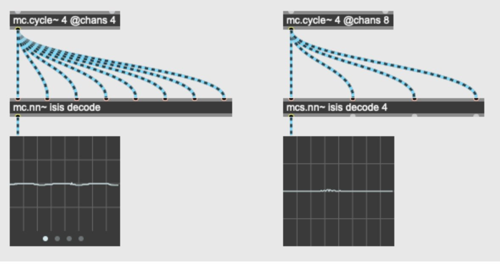

# Midterm Proposal: Audio Synthesis with RAVE

## What I Would Like to Do

I want to compose an original song using sounds generated entirely through neural synthesis, split across two tools:

- **RAVE `v2_small`** — trained on a self-collected dataset of ~1,200 drum one-shots, used via command line to generate one shots and 808s (kicks, hats, snares, etc...)
- **`nn~` ISIS in Max/MSP** — used to **generate long-form textures, pads, and synth elements** by manipulating the latent vector interactively in Max.
- **Ableton** — all generated elements are imported and assembled into a finished, composed song.

Max is used purely as a **latent control tool**, not for live performance. I will program all other parts and control max with external model. All musical composition happens in Ableton except for the synth/pad..

---

## How I Will Do It

### 1. Dataset Preparation (One-Shot Samples)

The training dataset consists of **~1,200 self-collected one-shot percussion samples** spanning kicks, hi-hats, and snare/clap elements. Since RAVE trains on continuous audio rather than individual short clips, the samples need to be sorted, prepared, and looped into long audio files before preprocessing.

#### Step 1 — Sort Samples by Type
Organize the currently mixed/unsorted folder into categories:

Control the timbral balance of the training data and build separate looped files per category.

#### Step 2 — Normalize All Samples
Before looping, normalize each sample with RX to a consistent peak level to avoid volume imbalance in the training.


#### Step 3 — Loop Samples to Build Duration
~1,200 one-shots likely totals only 5–15 minutes of audio so it's way below RAVE's recommended **1–3 hours**. I will try to loop each category's samples repeatedly to reach the target duration:


**Target durations per category:**

| Category | Est. raw duration | Loop target |
|---|---|---|
| Kick | ~2–4 min | ~60 min |
| Hi-Hat | ~2–4 min | ~60 min |
| Snare/Clap | ~2–4 min | ~60 min |

#### Step 4 — Convert to RAVE-Compatible Format
All files must be **44.1kHz, mono, 16-bit WAV**:
Will utilize RX batch processing and fit the all samples.

#### Step 5 — Final Dataset Folder Structure
```
/dataset_final/
  kicks_looped.wav      # ~1 hour
  hats_looped.wav       # ~1 hour
  snare_looped.wav      # ~1 hour
```
This folder is then passed directly to `rave preprocess` in Step 2.

### 2. Training the RAVE Model

RAVE uses a two-stage training procedure: first representation learning (VAE pre-training), then adversarial fine-tuning. The result is a compressed latent space that can be decoded back into high-quality audio in real time.

#### Step 1 — Set Up Environment with Miniconda3
```bash
# Download and install Miniconda3 (if not already installed)
wget https://repo.anaconda.com/miniconda/Miniconda3-latest-MacOSX-arm64.sh
bash Miniconda3-latest-MacOSX-arm64.sh
# Restart terminal after installation, then:

# Create a dedicated conda environment for RAVE
conda create -n rave python=3.9
conda activate rave

# Install torch and torchaudio first (choose version matching your hardware)
conda install pytorch torchaudio -c pytorch

# Then install acids-rave
pip install acids-rave
```
> activate RAVE: `conda activate rave` please please please!!!!!

#### Step 2 — Preprocess / Build the Dataset
RAVE requires audio to be preprocessed into a binary database before training:
```bash
rave preprocess \
  --input_path /path/to/your/audio/folder \
  --output_path /path/to/preprocessed_data \
  --sampling_rate 44100
```
- Input: folder of WAV files (44.1kHz mono recommended)

#### Step 3 — Train the Model
```bash
rave train \
  --config v2_small \
  --db_path /path/to/preprocessed_data \
  --out_path /path/to/training/output \
  --name my_percussion_model
```
- `--config v2_small` uses a lighter version of the RAVE v2 architecture — fewer parameters, faster training, and lower CPU load in real time inside Max. Ideal for percussive material and laptop performance
- Other available configs for reference: `v1`, `v2`, `percussion`, `melodic` — but `v2_small` is the best fit here
- Training runs in **two phases automatically**:
  - **Phase 1 – Representation Learning** (~1.5M steps): the VAE encoder/decoder learns to compress and reconstruct audio
  - **Phase 2 – Adversarial Fine-tuning** (~1.5M steps): a discriminator sharpens audio quality and realism
- Full training on a single GPU (e.g. NVIDIA Titan V) can take **~6 days** for 3M steps
- For a usable draft model, results often emerge after ~300k–500k steps (~hours on a good GPU)
- Monitor progress with TensorBoard:
  ```bash
  tensorboard --logdir /path/to/training/output
  ```

#### Step 4 — Monitor Training with TensorBoard
Track loss curves and audio reconstruction quality in real time while the model trains:
```bash
tensorboard --logdir /path/to/training/output
```
- Open `http://localhost:6006` in your browser to view training progress
- Key things to watch: reconstruction loss dropping in Phase 1, audio quality improving in Phase 2
- You can preview reconstructed audio samples directly in TensorBoard as training progresses

#### Step 5 — Export to TorchScript
Once training reaches a satisfying point, export the model as a `.ts` file:
```bash
rave export \
  --run /path/to/dataset/ \
  --name nameofmodel \
  --output . \
  --streaming True \
  --fidelity 0.0–1.0
```
- `--run` — path to your dataset/training folder
- `--name` — name for the exported model file
- `--output .` — exports to the current directory
- `--streaming True` — enables real-time buffer-based streaming, required for use in Max/MSP
- `--fidelity` — float between `0.0` and `1.0`; controls the trade-off between reconstruction accuracy and latent space compactness (higher = more faithful to input, lower = more compressed and malleable)
- Output: a `.ts` (TorchScript) file — place this in a folder accessible via Max's file preferences

#### GPU / Cloud Options
- **Local**: NVIDIA GPU strongly recommended (training on CPU is impractically slow)
- **Google Colab Pro**: accessible entry point, though session limits apply
- **DataCrunch.io / Vast.ai**: affordable GPU rental for longer training runs

> **Reference:** [RAVE GitHub Repository](https://github.com/acids-ircam/RAVE) · [Training Tutorial](https://www.youtube.com/watch?v=MlbkSMLoWBk&t=406s)

### 3. Setting Up nn~ in Max/MSP
- Install the `nn~` external from the IRCAM package inside `Documents/Max [version]/Packages/`
- Uncompress the `.tar.gz` file from the Package folder
- Resolve any macOS codesigning issues using the terminal commands:
  ```bash
  cd "/Max X/Packages/nn_tilde"
  sudo codesign --deep --force --sign - support/*.dylib
  sudo codesign --deep --force --sign - externals/*/Contents/MacOS/
  xattr -r -d com.apple.quarantine externals/*/Contents/MacOS/*
  ```
- Load the trained model into an `nn~` object in Max and explore the help patch and nn Overview

### 4. Sound Generation

Texture / Pad / Synth Elements — ISIS in Max/MSP (`nn~`)

Long-form textures, evolving pads, and synth tones are generated inside **Max/MSP** using the **ISIS model** loaded via `nn~`. The latent space is manipulated interactively to sculpt and morph sounds, then rendered out as audio.




**Approach:**
- Load ISIS: `nn~ isis decode`
- Drive latent dimensions with LFOs, envelopes, and manual controls to shape evolving textures and pads
- Record the Max output as WAV stems — these become the atmospheric and harmonic layers in Ableton

**Reference:** [IRCAM Forum – Neural Synthesis in Max 8 with RAVE](https://forum.ircam.fr/article/detail/tutorial-neural-synthesis-in-max-8-with-rave/) · [YouTube – Neural Synthesis Demo](https://www.youtube.com/watch?v=o09BSf9zP-0)

---

### 5. Composition in Ableton Live

All neural elements — RAVE percussive WAVs and ISIS texture stems — are imported into Ableton Live where the actual song is composed.

The final deliverable is a completed, mixed song built entirely from neural audio elements.

---

## Questions, Concerns, and Stretch Goals

### Questions
- How large does my dataset need to be?
- What are the recommended training durations / GPU requirements for a usable model?
- Can I use a pre-trained RAVE model as a starting point and fine-tune on my own data?

### Concerns
- **Training time**: RAVE models can take many hours to days to train. This may need access to a GPU (e.g., via Google Colab or a cloud service)
- **Dataset volume**: Found more samples ?
- **consistency** should I blend in more different genre of sound(like acoustic kick and a d&b kick)?

### Stretch Goals
- Train **multiple** RAVE models on different elements and blend them in Max
- Explore using RAVE's encoder to re-synthesize external audio in real time through the trained model's timbre
- live performance(latent jam?)
---

## References

- [RAVE GitHub Repository](https://github.com/acids-ircam/RAVE)
- [IRCAM Tutorial: Neural Synthesis in Max 8 with RAVE](https://forum.ircam.fr/article/detail/tutorial-neural-synthesis-in-max-8-with-rave/)
- [YouTube: RAVE Training Tutorial](https://www.youtube.com/watch?v=MlbkSMLoWBk&t=406s)
- [YouTube: RAVE + Max Demo 1](https://www.youtube.com/watch?v=o09BSf9zP-0)
- [YouTube: RAVE + Max Demo 2](https://www.youtube.com/watch?v=MlbkSMLoWBk)
