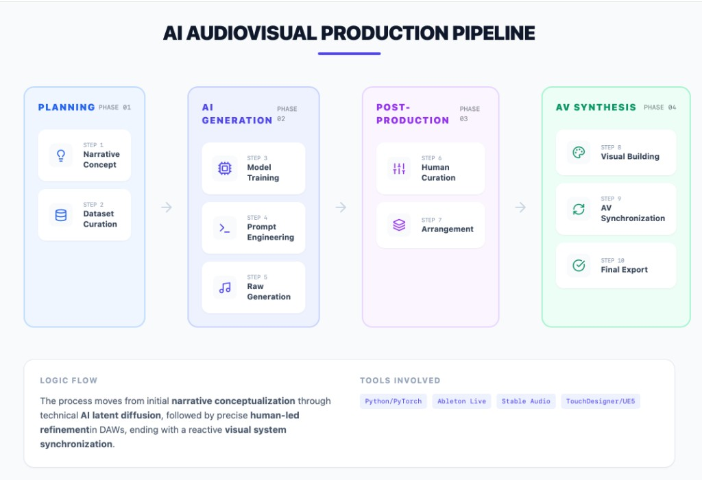

# Genre Cannon – Analytical Review

## Song Selection

- **Song Title:** Genre Cannon  
- **Artist / Team:** Dadabots  
- **Year:** 2024  

## Brief Summary

Genre Cannon is an audiovisual project that explores genre as a compositional
material rather than a fixed musical identity. Using generative audio models
capable of producing thousands of stylistic variations, the project moves
fluidly across genre boundaries, creating rapid transitions and hybrid forms.
Rather than presenting a single cohesive song, the work frames music generation
as a journey through evolving stylistic environments.

Dadabots founders CJ Carr and Zack Zukowski studied at Berklee College of Music,
where their focus on music production and audio technology shaped their
experimental approach. Their background is reflected in the project’s emphasis
on raw-audio synthesis, sound design, and technological transparency.

(Dadabots, 2024; Stability AI, 2024)

## Technical Analysis

Dadabots employ neural audio synthesis systems that generate raw waveform audio
rather than symbolic formats such as MIDI. Unlike symbolic models that predict
notes and timing separately, raw-audio systems learn directly from waveform
data, capturing timbral, spectral, and temporal relationships simultaneously.

For Genre Cannon, the primary model used is Stable Audio Open, an open-source
text-conditioned generative audio model. Earlier Dadabots work was heavily
influenced by SampleRNN-style autoregressive models, which established their
practice of prioritizing timbre and texture over traditional note-based
composition.

Raw-audio synthesis is particularly suited to genre experimentation because many
genre-defining features—distortion, saturation, noise, microtiming variation—are
difficult to represent symbolically. By working directly in the waveform domain,
the system can reproduce complex hybrid textures and stylistic nuances that
would be lost in MIDI-based abstraction.

### Input / Output Formats

- **Input:** Text prompts or conditioning data  
- **Output:** Raw waveform audio (WAV format)  
- **Internal Representation:** Continuous audio samples and learned latent
  embeddings  

### Tool Ecosystem

- **Primary Model:** Stable Audio Open  
- **Historical Influence:** SampleRNN  
- **DAW:** Ableton Live  

Ableton Live functions as the central production environment, where generated
material is curated, sampled, arranged, and structurally shaped.

### Data Pipeline

Training data consists of large collections of genre-diverse audio recordings.
Rather than manually designing features, the models learn implicit
representations through exposure to waveform data.

Preprocessing includes normalization, segmentation, and format standardization.
Model training occurs offline, while inference enables near-real-time generation
for creative iteration.

Human intervention remains central at several stages: concept development,
dataset selection, model configuration, curation, and final arrangement.

## Musical Analysis

Unlike traditional song structures, Genre Cannon does not center on a fixed
harmonic framework or stable form. Instead, genre becomes the organizing
principle.

### Harmony & Tonality

Harmonic language shifts across segments depending on the generated style.
Rather than emphasizing functional tonal progressions, many sections rely on
modal centers, riff-based repetition, or textural density. Harmonic movement
often feels locally coherent but lacks long-term tonal development.

This reflects the behavior of raw-audio models: they reproduce statistical
spectral patterns rather than consciously structured harmonic narratives.

### Melody

Melodic content varies significantly between genre zones. In some passages,
short repeating motifs function as stylistic signals. In others, melody dissolves
into texture or rhythmic articulation. The system captures the surface
characteristics of melodic styles but does not consistently develop extended
thematic arcs.

### Rhythm & Groove

Rhythm functions primarily as a marker of stylistic transition. Groove stability
is secondary to stylistic transformation. High-density sections contrast with
sparse or ambient passages, creating perceptual shifts that signal genre change.

### Form & Structure

The structure resembles a sequence of stylistic zones rather than a
conventional verse–chorus form:

- Genre Zone A  
- → Hybrid Transition  
- → Genre Zone B  
- → Fusion Expansion  
- → Transformational Shift  

The project emphasizes stylistic mobility over narrative songwriting.

### Texture & Dynamics

Texture is the dominant compositional parameter. Layering, density variation,
and timbral contrast drive change more than harmonic progression. Dynamic shifts
occur primarily through textural expansion and reduction.

## Workflow Diagram

## Genre Cannon – Critical Review

What makes Genre Cannon compelling is its fixation on transition itself.
Movement from jazz to metal, folk to electronic, often occurs with
near-instantaneous fluidity. That fluency becomes the project’s central
argument: genre appears less as a stable cultural identity and more as a
collection of stylistic surfaces that can be recombined.

The title reinforces this idea. “Cannon” suggests propulsion and force — genre
deployed rapidly rather than cultivated over time. In this framing, stylistic
identity becomes modular and mobile.

The emotional depth is limited, but this feels intentional. The project does not
attempt to function as a conventional song. Instead, it positions itself as an
exploration of style generation and recombination.

The commitment to open-source tools is also significant. In a commercial AI
landscape where training data and models are often obscured, Dadabots’
transparency represents a distinct philosophical stance. The project invites
scrutiny and participation rather than exclusivity.

At the same time, this openness intensifies an unresolved tension: when
genre-switching becomes effortless, what remains for musicians who spent decades
developing distinctive sonic identities? If stylistic markers can be
statistically modeled and reproduced, authorship and ownership become
increasingly ambiguous.

Genre Cannon does not resolve this dilemma. Its strength lies in articulating
the question clearly.

## References

- Agostinelli, A., et al. (2023). MusicLM: Generating Music From Text.
  https://arxiv.org/abs/2301.11325  
- Dadabots. (2024). About Dadabots. https://dadabots.com/about  
- Dieleman, S., et al. (2016). WaveNet: A Generative Model for Raw Audio.
  https://arxiv.org/abs/1609.03499  
- Stability AI. (2024). Stable Audio Open Documentation.  

## Tools Used

- ChatGPT was used for language refinement and clarity editing.  
- Google Gemini was used to generate the workflow diagram layout.  
- All analytical content, technical explanations, and critical interpretations
  were independently developed and reviewed by me.