# Getting Over It — Emotion-Reactive Sound System

## What I Made

I built a system that reacts to how I play Getting Over It
by detecting my emotional state through trackpad movement
and playing different sounds accordingly. The goal was to
make the player feel even more frustrated — or at least
make the frustration audible.

## How Machine Learning Is Involved

I used Wekinator with classification, 5 classes:

- Class 1: Calm
- Class 2: Focused
- Class 3: Giving Up
- Class 4: Slightly Angry
- Class 5: Angry

I sent 6 input features from the trackpad via OSC:

- x: horizontal position
- y: vertical position
- speed: how fast the trackpad is moving
- still: how long the trackpad has been stationary
- pressure: approximate press strength
- click: whether the trackpad is clicked (0 or 1)

For example, a typical data point looked like:
`x=0.58 y=0.77 speed=0.03 still=0.00 pressure=0.00 click=0`

Wekinator learned to classify my emotional state from
these movement patterns.

I recorded about one minute of data per class, all from
myself. In the end my computer handled it fine — Wekinator
trained successfully with around 20,000 examples — but the
data quality could be better. The 5 emotional states were
not distinct enough in my recordings, which made
classification less precise than I hoped.

## How I Implemented It

The system uses two OSC ports:

- Port 6448: Python reads trackpad movement and sends
  6 features to Wekinator
- Port 12000: Wekinator sends its classification result
  to a second Python script that plays the corresponding
  sound file using pygame

I originally planned to use Max/MSP for both input and
output. The `hi` object couldn't read the trackpad on
my Mac, and Max didn't have MSP installed so audio
objects like `dac~` and `sfplay~` didn't work. I ended
up moving everything to Python instead.

## Tools Used

- Wekinator (classification, 5 classes)
- Python + python-osc (trackpad reading and sound playback)
- pygame (audio)
- Max/MSP (attempted, partially used for learning)
- Claude and Cursor (code writing and debugging)

## What I Learned

- How OSC ports work and how to route data between
  applications
- How to use Wekinator for classification
- Basic Max patching and OSC communication
- That having too many inputs without a clear training
  plan makes ML harder, not easier
- How to send and receive OSC between applications
  using Python

## On Machine Learning as a Black Box

The system only had access to mouse movement data —
position, speed, stillness, pressure, and click. I
don't actually know if these inputs are meaningful
indicators of emotion, or if Wekinator was just
memorizing patterns in how I move my mouse. I had
no way to inspect what the model learned or why it
produced a certain output. That made it hard to
know what to fix when the classification felt wrong.

## Reflection

The hardest part was not knowing any of these tools
at the start. If I had more time I would try to find
better inputs that more directly reflect emotional
state, reduce the number of features, and find a way
to understand what the model is actually responding
to before trying to improve it.

## Workflow Diagram

