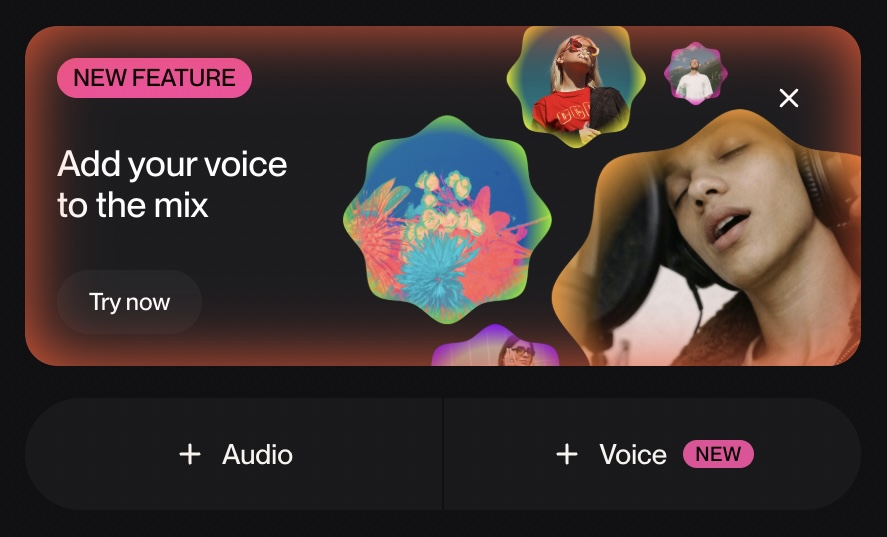
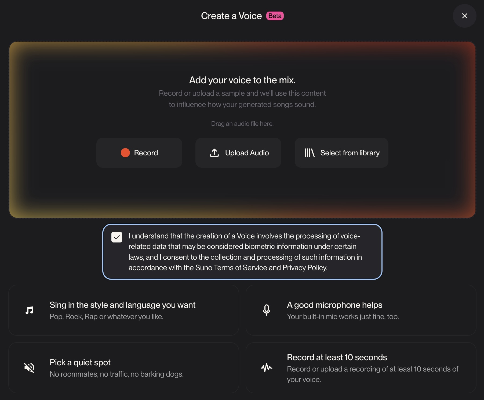
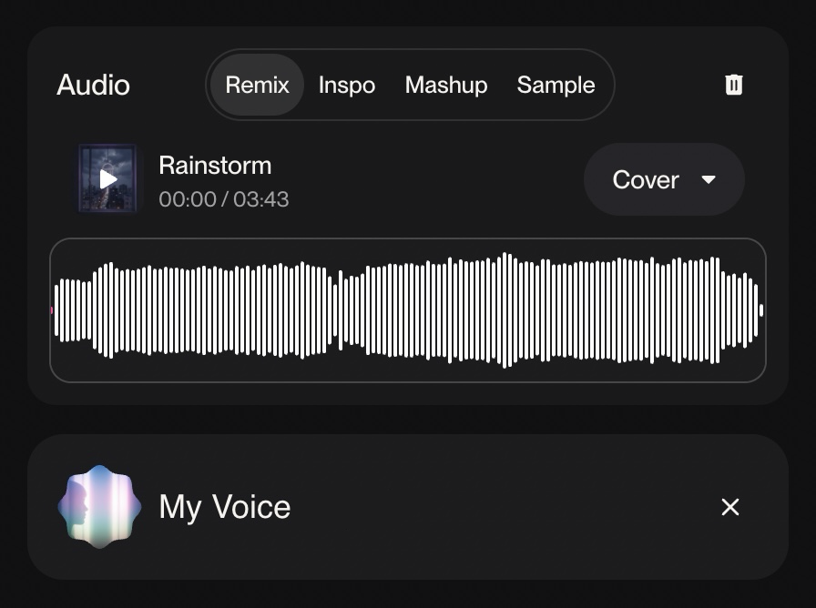

# MTEC-345 Research Work Phase 2: AI Tool Review

## Project Intention

I have a friend from the University of Toronto who makes music as a hobby. He writes original songs and also creates covers and remixes for popular songs in Mandarin. But he is self-taught in singing, so he has always wanted to improve his vocal skills, and I suggested that he try the new AI vocal cloning feature in Suno v5.5 and see what happens. Since he often writes new verses for his covers, I took one of his covers of a popular Chinese TikTok song called Rainstorm and created a remix using his newly cloned voice.

---

## Process

I started by taking his cover of Rainstorm and remixing the instrumental using workflows and tools I explored during my previous midterm project. To guide the vocal clone with the correct melody, I temporarily included his original vocal in the track.

I then took his raw vocal and uploaded it to Suno to train the vocal clone. The process also required an identity verification, where the user had to read a provided line, so I did this step with my friend over a video call.

Once the custom voice profile was created, I fed the remix into Suno to generate the cloned vocal topline. I selected one of the outputs and used Moises to separate the lead vocal and background vocals. The rest of the mixing and mastering was completed in Pro Tools.

---

## Final Product

[Listen](https://drive.google.com/file/d/16ZXyjSvnedBp73Em3JpfTGm3arIJzhMQ/view?usp=sharing)

---

## Reflection

I must say that the pronunciation and clarity of the vocal was very impressive. But I found that the vocal clone did not fully capture the characteristics of my friend’s original voice and had too much high-frequency content. I’m not sure whether the verification recording was included in the training data, but if it was, the lower quality of a phone video call could explain the result. It also took around 30 attempts to get a topline that followed the melody consistently without unnatural register shifts or phrasing changes.

Overall, I think Suno v5.5’s vocal cloning feature is a very interesting tool. It has the potential to let people hear their own voice singing their favorite songs, and it can be especially useful for non-vocalist songwriters and producers to quickly create demos. If the technology continues to improve, especially in capturing phrasing, register control, and syllable alignment, it could eventually be used for vocal doubling, replacing imperfect takes, or even covering ranges that are difficult for a singer to perform.

---